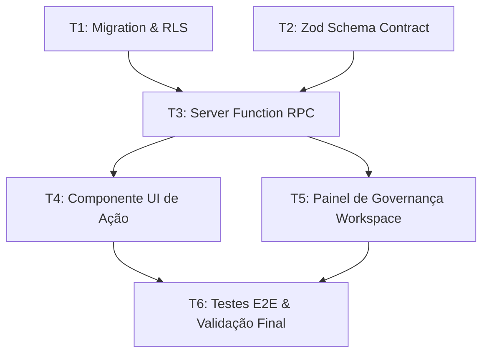

# Teoria de Grafos DAG & Cálculo do Caminho Crítico

Todo projeto decomposto deve ser modelado como um Grafo Acíclico Direcionado (DAG).

## Algoritmo de Validação (Topological Sort)
- O grafo $G = (V, E)$ onde $V$ são as tarefas e $E$ as dependências de precedência.
- Se houver ciclo ($A 	o B 	o A$), o motor sinaliza imediatamente erro fatal de planejamento.

## Estratificação em Camadas de Execução
- **Layer 0:** $orall v in V mid 	ext{in-degree}(v) = 0$ (tarefas independentes que rodam no minuto zero).
- **Layer 1:** Tarefas cujos pré-requisitos pertencem exclusivamente ao Layer 0.
- **Layer $k$:** Tarefas cujos pré-requisitos estão em $igcup_{i=0}^{k-1} 	ext{Layer}_i$.

## Determinação do Caminho Crítico
- Calcula o caminho de maior duração da raiz às folhas do DAG.
- Tarefas no caminho crítico possuem folga zero ($	ext{Slack} = 0$). Qualquer atraso nelas impacta a data final do lançamento.

## Exemplo de Visualização Mermaid

