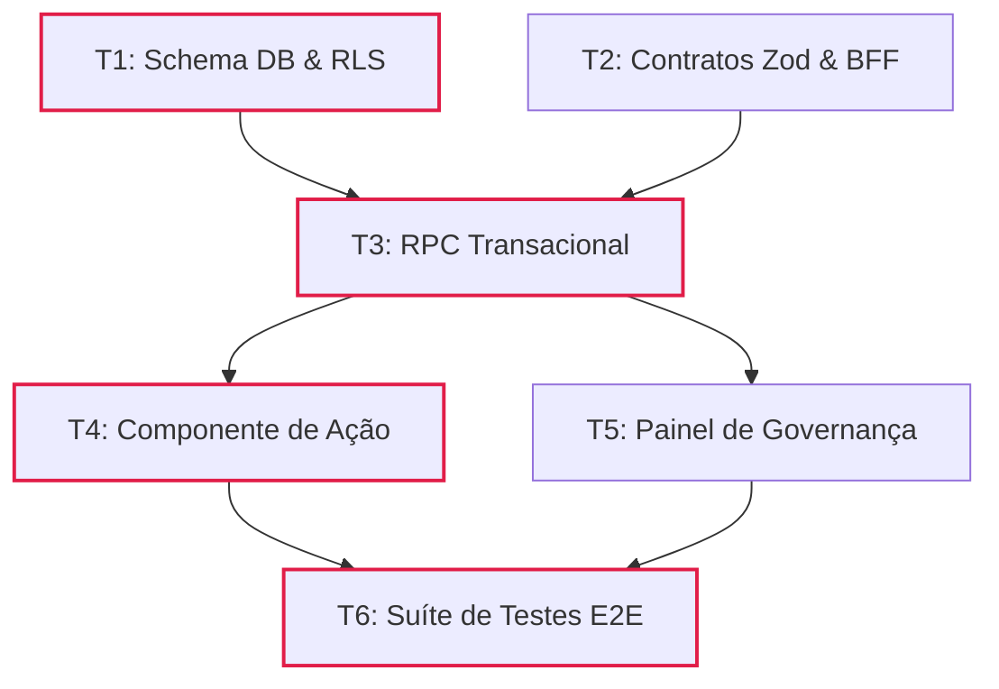

```mermaid
graph TD
  %% Layer 0: Fundações Independentes
  T1["T1: Schema DB & RLS"]
  T2["T2: Contratos Zod & BFF"]

  %% Layer 1: Lógica de Domínio
  T3["T3: RPC Transacional"]
  T1 --> T3
  T2 --> T3

  %% Layer 2: Interfaces
  T4["T4: Componente de Ação"]
  T5["T5: Painel de Governança"]
  T3 --> T4
  T3 --> T5

  %% Layer 3: Validação
  T6["T6: Suíte de Testes E2E"]
  T4 --> T6
  T5 --> T6

  classDef critical stroke:#e11d48,stroke-width:2px;
  class T1,T3,T4,T6 critical;
```
