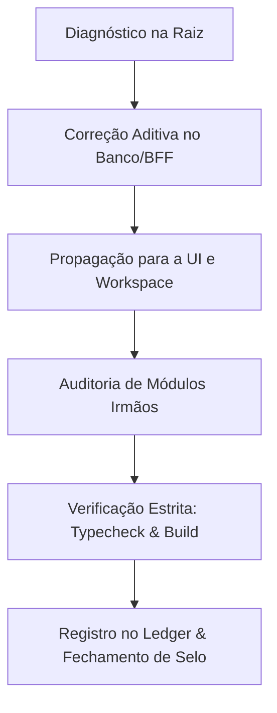

# Recursive Fix — Motor de Correção Profunda na Raiz

## Missão
Garantir que nenhuma correção seja um remendo isolado. Quando um problema é diagnosticado, a solução é implementada na raiz e propagada recursivamente para todos os módulos correlatos.

## O Ciclo Recursivo de 6 Etapas

## Regras de Execução
1. **Sem Remendos Superficiais:** Proibido mascarar erros com `catch {}` vazio, esconder botões quebrados ou forçar estilos com `!important`.
2. **Propagação Obrigatória:** Se um uploader ganhou suporte a `Ctrl+V`, todos os uploaders similares do sistema devem receber a mesma melhoria. Se um loader ganhou `try/catch`, todos os loaders do mesmo domínio devem ser blindados.
3. **Paridade CMS ↔ View:** Se um novo dado foi adicionado ao modelo de banco, a tela de cadastro do lojista (CMS) e a vitrine pública devem refletir o campo simultaneamente.
4. **Verificação Mecânica:** A cada ciclo de correção, validar:
   - TypeScript: `node --max-old-space-size=6144 ./node_modules/typescript/bin/tsc --noEmit`
   - Design Lint: `node scripts/design-lint.mjs --ratchet`
