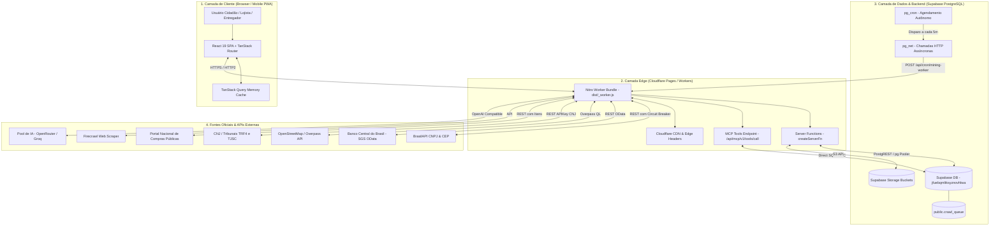

# Onda 02 — Mapa de Runtime e Topologia de Execução

## 1. Ciclo de Vida e Processos de Execução

O sistema opera em duas topologias de execução estritamente desacopladas:

---

## 2. Inventário de Recursos de Runtime

| Recurso | Detalhes Técnicos | Política de Resiliência |
| :--- | :--- | :--- |
| **Runtime de Borda** | Cloudflare Workers (V8 Isolates), < 50ms cold start | Limite de CPU por requisição, streaming responses |
| **Servidor de Desenvolvimento** | Vite v6.0 + TanStack Start Dev Server (Porta 3000/5173) | Hot Module Replacement (HMR) ativado |
| **Banco de Dados** | Supabase Postgres 15/16 (`jfuebqmltksyznovhlwa.supabase.co`) | Supavisor Connection Pooling (Transaction Mode) |
| **Filas Assíncronas** | Tabela `public.crawl_queue` com prioridade (0-10) e state lock | `retry_count`, timeout de 30min para itens travados em `processing` |
| **Agendador (Cron)** | Extensão `pg_cron` nativa do PostgreSQL + Cloudflare Cron | Intervalo de 5 min executando worker de mineração |
| **Circuit Breakers** | `crawler-circuit-breaker.ts` (CLOSED -> OPEN -> HALF_OPEN) | Protege domínios externos contra rate limit ou banimento |
| **Storage de Mídia** | Buckets S3-compatíveis (`news`, `products`, `avatars`, `assets`) | CDN pública com URLs canônicas assinadas |

---

## 3. Mecanismos de Retry e Tratamento de Falhas

1. **Crawler Batch Engine:** Todo item processado em `executeCrawlQueueBatchDirect` transita atomicamente de `pending` -> `processing`. Em caso de erro na extração, captura a exceção, salva o stacktrace truncado em `error_message`, incrementa `retry_count` e transita para `failed` sem derrubar o loop de execução.
2. **Cascata de APIs Públicas:**
   - **Estabelecimentos:** Overpass API (Bounding Box Chapecó) -> Fallback Nominatim -> Fallback Manual.
   - **CNPJ & Empresas:** BrasilAPI -> Fallback Minha Receita -> Fallback ReceitaWS.
   - **Tribunais:** Endpoint oficial DataJud TRF4 (`api_publica_trf4`) com Authorization Key oficial do CNJ.
3. **Model Gateway (IA):** Chamadas a modelos são orquestradas via `ai-core-gateway.functions.ts` com fallback automático de provedor (OpenRouter -> Groq -> Local Cache) e medição de latência em milissegundos.
