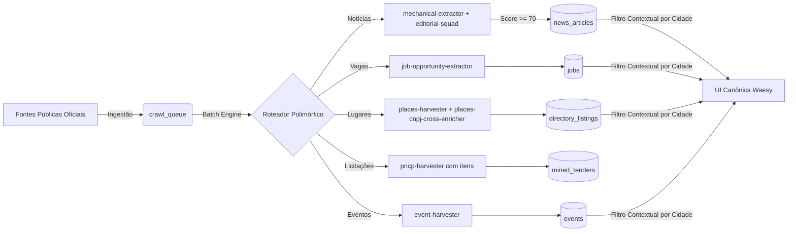

# Onda 04 — Linhagem e Fluxo de Dados Ponta a Ponta

## 1. Visão Geral da Cadeia de Linhagem

Todas as entidades operacionais da plataforma Waesy respeitam a regra inviolável:
**Origem Auditável -> Ingestão Fila -> Normalização Mecânica -> Enriquecimento -> Persistência Canônica -> Indexação Contextual -> Consumo de UI**.

---

## 2. Linhagem Detalhada por Entidade

### 2.1. Notícias & Matérias Regionais (`news_articles`)
- **Origem:** Feeds RSS e sitemaps XML de portais de imprensa local (ClicRDC, ND Mais, Chapecó Online, DI Regional, G1 SC).
- **Ingestão:** `sitemap-crawler.engine.ts` e `rss-ingester.engine.ts` enfileiram na `crawl_queue` com `entity_type: 'news'`.
- **Normalização Mecânica:** `mechanical-extractor.ts` limpa marcações HTML, scripts e anúncios, extraindo corpo Markdown, lead, autor e data.
- **Validação:** `integrity-gate.ts` avalia densidade textual (`wordCount >= 80`, contagem de parágrafos, imagem válida). Score mínimo: 70.
- **Curadoria Editorial:** `editorial-squad.ts` estrutura seções móveis, título semântico e kicker.
- **Armazenamento:** Inserção imediata em `news_articles` com `status: 'published'`, `city: 'Chapecó'`, `state: 'SC'`.
- **Consumo:** `listPublicArticles` (`src/services/news.functions.ts`) filtrado por cidade ativa (`resolveActiveCity`).
- **Apresentação:** Feed `/noticias`, `<NewsCard>`, carrossel de destaques e modal de leitura idêntico ao de matérias civis.

### 2.2. Vagas de Emprego (`jobs`)
- **Origem:** Portais regionais e páginas corporativas locais.
- **Ingestão:** `crawl_queue` (`entity_type: 'job'`).
- **Normalização:** `job-opportunity-extractor.ts` interpreta Schema.org `JobPosting` e heurísticas de contratação (CLT, PJ, Estágio).
- **Armazenamento:** `jobs` com `status: 'active'`, `location_city`, `location_state`.
- **Consumo:** `listPublicJobs` (`src/services/jobs.functions.ts`) com filtro por `city` e área.
- **Apresentação:** Feed `/empregos` com contato direto via WhatsApp ou candidatura externa.

### 2.3. Comércio & Estabelecimentos (`directory_listings`)
- **Origem:** OpenStreetMap via Overpass API com Bounding Box urbano.
- **Enriquecimento Cruzado:** `places-cnpj-cross-enricher.ts` consulta a Receita Federal via BrasilAPI, associando CNPJ oficial, CNAE e telefone.
- **Armazenamento:** `directory_listings` com `city: 'Chapecó'`, geolocalização GPS e score de qualidade elevado para 95.
- **Consumo:** `getPublicDirectory` (`src/services/directory.functions.ts`) com filtro por `city`.
- **Apresentação:** Diretório comercial `/diretorio`, mapa interativo e vitrines de bairro.

### 2.4. Licitações e Compras Públicas (`mined_tenders`)
- **Origem:** API Oficial do Portal Nacional de Contratações Públicas (PNCP).
- **Ingestão:** `pncp-harvester.ts` filtrando por código IBGE (4204202 para Chapecó).
- **Extração Profunda:** `pncp-extractor.ts` consulta o endpoint `/itens` para registrar os lotes e valores unitários estimados.
- **Armazenamento:** `mined_tenders` com digest estruturado para cotações e inteligência de mercado.

### 2.5. Agenda Cultural & Eventos (`events`)
- **Origem:** Portais de eventos e programações municipais oficiais.
- **Ingestão:** `event-harvester.ts` parseia Schema.org `Event`.
- **Armazenamento:** `events` com `city`, `state`, data de início/fim, local e link de ingressos.
- **Consumo:** `getPublicEvents` (`src/services/events.functions.ts`).
- **Apresentação:** Calendário `/eventos` com ingressos, confirmação de presença (RSVP) e filtros por cidade.
