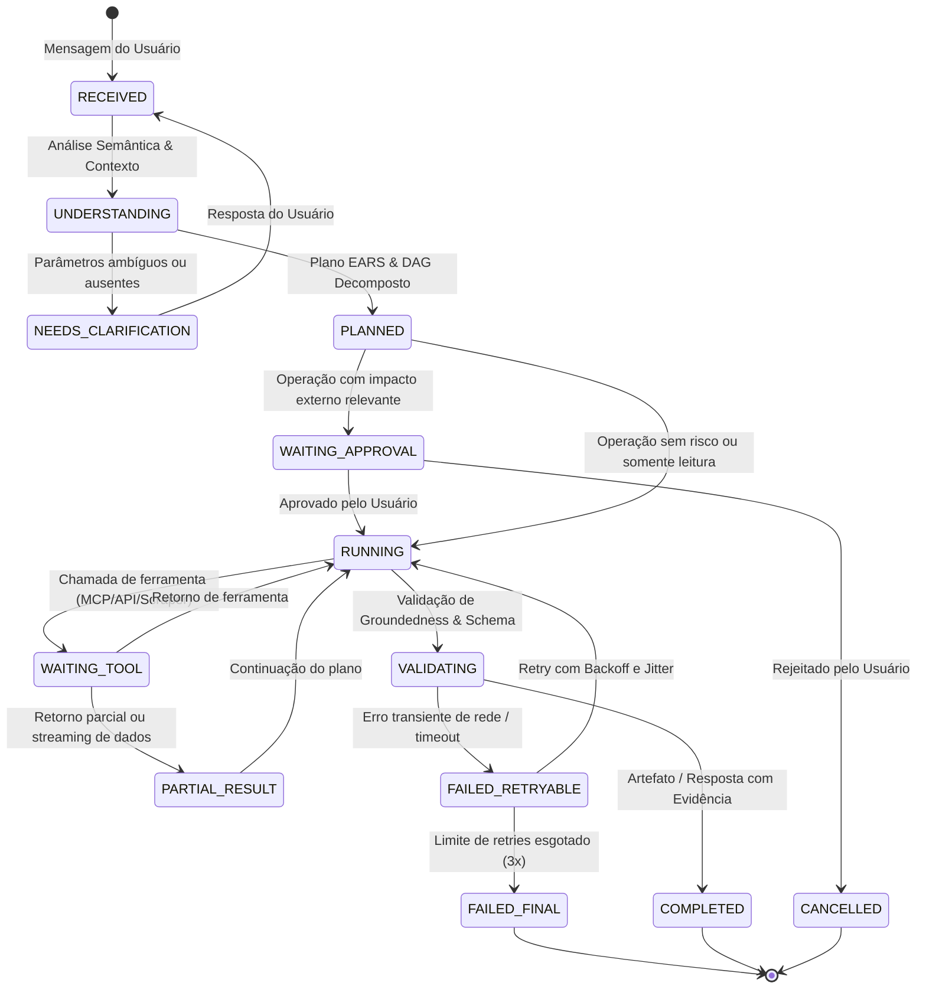

# Onda 06 & 07 — Contrato do Chat, Máquina de Estados e Resiliência

## 1. Máquina de Estados Canônica do Chat (13 Estados Formais)

Para evitar travamentos, loops ou telas brancas, o ciclo de vida de qualquer mensagem ou tarefa no chat do Waesy obedece estritamente aos seguintes estados determinísticos:



---

## 2. Descrição Normativa dos Estados

| Estado | Significado Técnico | Comportamento Obrigatório da UI |
| :--- | :--- | :--- |
| `RECEIVED` | Payload recebido e sessão autenticada | Indicador de leitura ativo, sem latência |
| `UNDERSTANDING` | Classificação de intenção e extração de entidades | Exibição de spinner suave ou shimmer |
| `NEEDS_CLARIFICATION` | Falta parâmetro essencial para execução | Formulário guiado ou botões de escolha direta |
| `PLANNED` | Plano em etapas (DAG) gerado | Exibição de checklist colapsável de passos |
| `WAITING_APPROVAL` | Efeito externo relevante detectado (publicação/compra) | Modal ou Card de confirmação com payload exato |
| `RUNNING` | Execução ativa de etapas ou subagentes | Atualização de progresso via telemetria |
| `WAITING_TOOL` | Aguardando retorno de API, scraper ou banco | Tag visual indicando a ferramenta em execução |
| `PARTIAL_RESULT` | Streaming de texto ou linhas de planilha | Renderização progressiva sem bloquear o scroll |
| `VALIDATING` | Integrity Gate verificando sanidade dos dados | Validação determinística de Zod schema |
| `COMPLETED` | Tarefa finalizada com sucesso e evidência | Card de artefato vivo, botões de ação e exportação |
| `FAILED_RETRYABLE` | Falha recuperável (timeout, rate limit) | Aviso discreto com contagem regressiva de retry |
| `FAILED_FINAL` | Esgotados 3 retries ou erro irrecuperável | Mensagem honesta com causa-raiz e ação recomendada |
| `CANCELLED` | Abortado pelo usuário ou timeout de aprovação | Contexto preservado na conversa para retomada |

---

## 3. Formato Canônico de Mensagens e Eventos

### 3.1. Envelope de Mensagem
```typescript
export interface ChatMessageContract {
  id: string;
  thread_id: string;
  role: "user" | "assistant" | "system" | "tool";
  content: string;
  state: "RECEIVED" | "UNDERSTANDING" | "RUNNING" | "COMPLETED" | "FAILED";
  tool_calls?: Array<{
    id: string;
    tool_name: string;
    arguments: Record<string, any>;
    status: "pending" | "running" | "completed" | "failed";
  }>;
  artifacts?: Array<{
    id: string;
    type: "spreadsheet" | "dashboard" | "document" | "code" | "media";
    title: string;
    url?: string;
    data: Record<string, any>;
  }>;
  telemetry: {
    duration_ms: number;
    tokens_consumed: number;
    model_used: string;
    cache_hit: boolean;
  };
  created_at: string;
}
```

### 3.2. Garantias Invioláveis de Não-Quebra do Chat
1. **Preservação de Contexto:** Se uma ferramenta falhar ou expirar o timeout, o chat **NUNCA DESAPARECE** e nunca emite tela branca. Ele transita para `FAILED_RETRYABLE` ou `FAILED_FINAL` emitindo uma explicação clara e preservando o histórico da sessão.
2. **Separação de Instrução e Dados:** Conteúdo capturado de páginas web externas (notícias, sites, PDFs) é tratado estritamente como **dado não-confiável**, impedindo injeção de prompt (`prompt-injection`).
3. **Idempotência de Operações:** Toda operação com efeitos no banco utiliza `idempotency_key` derivada do hash da mensagem do usuário e da sessão.
