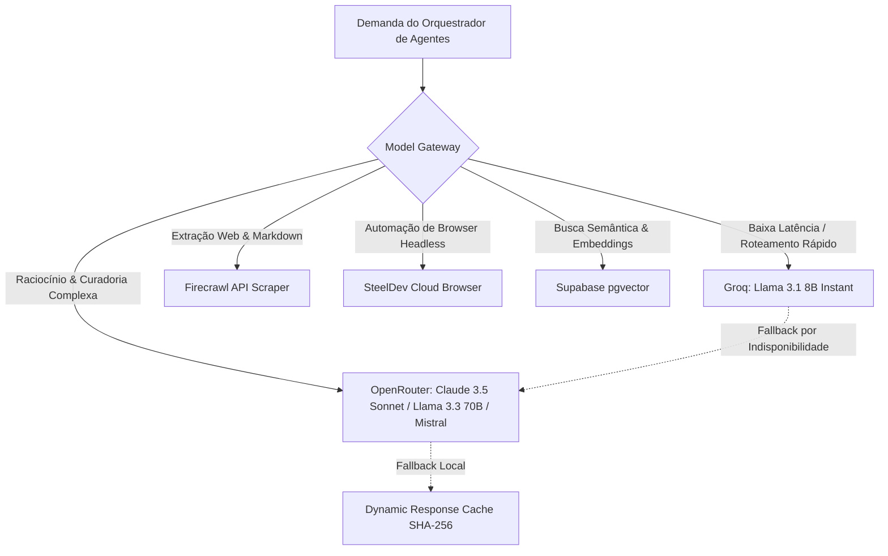

# Onda 12 — Catálogo de Integrações e Pool de Modelos de IA

## 1. Arquitetura do Gateway de Modelos (Model Gateway)

O acesso a modelos probabilísticos é gerido centralmente por `src/services/ai-core-gateway.functions.ts` e `src/services/ai-pool.ts`, protegendo o sistema contra vendor lock-in, variações bruscas de preço e quedas de disponibilidade.

---

## 2. Matriz de Integrações Externas Oficiais

| Provedor / API | Tipo | Finalidade Observada | Autenticação / Cofre | Política de Fallback |
| :--- | :--- | :--- | :--- | :--- |
| **PNCP (Governo Federal)**| REST Pública | Licitações, compras públicas e editais municipais | Nenhuma (API aberta oficial) | Cache local no PostgreSQL |
| **Banco Central do Brasil** | OData REST | Cotações diárias de moedas (Dólar/Euro) e taxas (Selic/IPCA) | Nenhuma (Portal Brasileiro de Dados) | Última série válida em `economic_indicators` |
| **OpenStreetMap / Overpass**| Overpass QL | Extração geográfica de comércio, saúde, lazer e mobilidade | Nenhuma (OpenData com User-Agent) | Nominatim API |
| **DataJud / CNJ** | REST | Acompanhamento de processos nos tribunais (TRF4, TJSC) | Chave pública oficial de API CNJ | Consulta manual / link oficial |
| **BrasilAPI** | REST | Enriquecimento cadastral de CNPJ, CEP e bancos | Aberta / Token opcional | Minha Receita -> ReceitaWS |
| **Mercado Pago** | REST / Webhook| Processamento de pagamentos Pix, Cartão e split | Access Token seguro no cofre | Notificação de falha transacional |
| **WhatsApp Cloud API** | Webhook / Graph| Notificações de pedidos e atendimento de vendas | Meta Bearer Token + Webhook Secret | E-mail / Push Notification |
| **Cloudflare CDN** | Edge Network | Distribuição de assets estáticos e cache de rotas | API Token Cloudflare Pages | Origem direta no worker |

---

## 3. Gestão Segura de Chaves e Credenciais
Nenhum segredo de API (tokens da OpenAI, OpenRouter, Groq, Mercado Pago, Meta) é exposto ao cliente browser. As chaves residem exclusivamente em variáveis de ambiente da Cloudflare e na tabela protegida `public.secret_vault` com acesso restrito a funções Server-Side.
