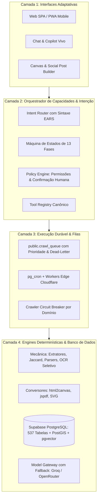

# Onda 17 & 18 — Arquitetura Atual vs. Arquitetura Alvo

## 1. Arquitetura Atual (Onda 17)

A arquitetura atual já apresenta alto grau de maturidade:
- **Camada de Apresentação:** React 19 + TanStack Router (rotas tipadas) + Tailwind CSS v4 + Radix UI + Lucide.
- **Camada de Borda e API:** TanStack Start SSR + Cloudflare Pages Worker (via Nitro wrapper) + Server Functions tipadas por Zod.
- **Camada de Persistência:** Supabase PostgreSQL com 537 tabelas, RLS ativo, pg_cron a cada 5m e pgvector.
- **Camada de Mineração:** 8 verticais industriais desacopladas processando a fila assíncrona `crawl_queue`.
- **Camada de Agentes & Chat:** Copilot Autônomo com cache SHA-256 e emissão de telemetria de passos.

---

## 2. Arquitetura Alvo (Onda 18)

A evolução arquitetural segue o Blueprint All-in-One em 4 camadas bem delimitadas:

### Princípios da Arquitetura Alvo:
1. **O modelo de IA decide o que fazer; o software determinístico executa.**
2. **Zero Mocks:** Toda resposta factível possui evidência, URL de fonte ou referência no banco.
3. **Idempotência Transacional:** Operações financeiras e de criação possuem chave única de reconciliação.
4. **Resiliência do Chat:** Se uma ferramenta ou crawler falhar, o chat mantém o contexto e permite retentativa imediata.
