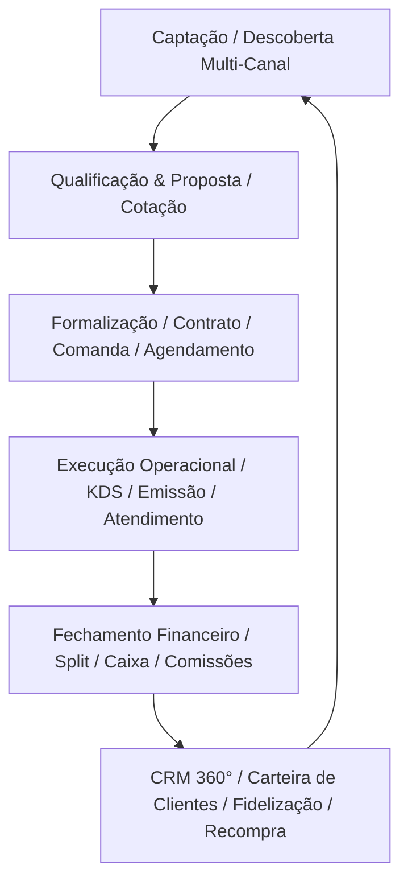

# Waesy Platform — Manual Canônico de Fluxos e Regras de Negócio

**Versão:** 1.0 — Documento vivo, atualizado a cada sprint.
**Fonte de verdade:** Este documento é derivado de rotas reais (`src/routes/**`), schemas de banco (`supabase/migrations/**`), serviços BFF (`src/services/**`) e conversas de design com o Product Owner.

> Este documento NÃO substitui o DOMAIN_MODEL.md (entidades e invariantes) nem o DESIGN.md (tokens e shells). Ele documenta FLUXOS E2E, REGRAS DE NEGÓCIO e CASOS DE USO completos para cada módulo.

---

## Atores do Sistema

| Ator                     | Contexto                           | Acesso                                                                    |
| ------------------------ | ---------------------------------- | ------------------------------------------------------------------------- |
| **Visitante**            | Não autenticado                    | Feed público, vitrine, produto, storefront, diretório, busca              |
| **Cliente**              | Autenticado, sem workspace         | Conta pessoal, pedidos, trocas, agenda pessoal, carrinho/checkout         |
| **Lojista/Owner**        | Autenticado, workspace Owner       | Todos os módulos do workspace, configurações, financeiro completo         |
| **Gestor**               | Autenticado, role manager          | Pedidos, catálogo, clientes, agenda, relatórios (sem financeiro completo) |
| **Vendedor**             | Autenticado, role seller           | PDV, pedidos próprios, catálogo leitura                                   |
| **Estoquista**           | Autenticado, role stock            | Estoque, recebimento, ajustes                                             |
| **Financeiro**           | Autenticado, role finance          | Caixa, pagamentos, comprovantes, comissões                                |
| **Conteúdo**             | Autenticado, role content          | CMS, publicações, mural, stories                                          |
| **Entregador Fixo**      | Autenticado, role courier          | Entregas atribuídas ao seu perfil                                         |
| **Entregador Avulso**    | Link Mágico (sem login)            | Apenas a entrega específica vinculada ao link                             |
| **Prestador de Serviço** | Autenticado, BusinessProfile       | Agenda de serviços, orçamentos, comissões de afiliado                     |
| **Admin Master**         | Autenticado, plataforma-wide admin | Todos os tenants, moderação, finanças da plataforma                       |

---

## Módulo 0 — Arquitetura Canônica de Dados e UI (A "Fundação")

Esta seção define o comportamento estrutural exigido para o ecossistema Waesy, independentemente do nicho. As regras aqui sobrepõem qualquer tela legada.

### 0.1 Profundidades de Edição (A Arquitetura de Formulários)

Toda tela de gestão (PDV, Catálogo, CRM) deve respeitar a _progressive disclosure_ usando quatro profundidades:

1. **Edição de Célula (Cell Editing):** Para valores atômicos de baixo risco (ex: alterar preço, ativar/desativar status, mudar estoque). Valida localmente, salva no servidor sem abrir modal, e restaura o valor em caso de falha de rede.
2. **Edição de Linha (Row/Inline Expand):** Para modificar grupos curtos (ex: sub-variantes de um produto na tabela). Expande a linha atual sem navegar de página.
3. **Edição em Painel Lateral (Side-Panel/Sheet):** Para manter o contexto da lista. Ex: alterar restrições ou horários rápidos enquanto se observa o resto da tabela.
4. **Edição em Página Completa (Master-Detail com Truthful Preview):** Reservada para criação completa. No desktop, o formulário ocupa a esquerda e a direita renderiza uma **Prévia Fiel (Truthful Preview)** estática, mostrando como o item será visto na página pública (usando o _renderer_ oficial, sem inventar dados).

### 0.2 O Modelo Universal de Oferta (Taxonomia)

A Waesy não usa o conceito restrito de "Produto com Variações". Ela modela o _commerce_ como uma **Oferta Universal**, que usa _blueprints_ para assumir formatos de nicho (Roupa, Hambúrguer, Agendamento, Vaga).
Para não haver colapso, a taxonomia de personalização é rígida:

- **Variante (SKU):** Uma unidade que muda radicalmente o item base. Geralmente tem SKU próprio, preço base próprio e controla estoque fisicamente (Ex: "Camisa Preta Tamanho M").
- **Opção (Modificador):** Escolhas que personalizam a Oferta sem criar um SKU estrutural novo. (Ex: "Ponto da Carne", "Cor da Fita").
- **Adicional:** Um tipo de Opção que adiciona preço ao total e pode baixar insumos independentes. (Ex: "Bacon extra").
- **Composição / Ficha Técnica:** Insumos consumidos silenciosamente na retaguarda quando o item é vendido. (Ex: pão, embalagem).
- **Observação:** Texto livre digitado pelo cliente. (Apenas se a política da Oferta permitir).

> Se o usuário pede "Tamanho da Pizza", pode ser uma Variante (se o preço mudar radicalmente e tiver caixas diferentes) ou um Grupo de Opção do tipo "Escolha 1". O sistema deve suportar ambos, dependendo da complexidade do lojista.

---

## Módulo 1 — Social / Comunidade

### 1.1 Fluxo do Feed Principal

**Rota:** `/` (social-feed)
**Atores:** Todos

**Fluxo:**

1. Usuário acessa a raiz `/`.
2. SSR carrega a primeira página do feed (getMuralFeed).
3. Feed exibe posts em ordem cronológica reversa por padrão.
4. Scroll infinito carrega próximas páginas via `cursor`.
5. Composer (PublishSheet) abre um drawer para publicar.
6. Post pode ter: texto, imagens, referência a produto/evento/serviço/classificado.
7. Ações em cada post: Curtir, Comentar, Compartilhar, Salvar, Reportar.
8. Botão de 3 pontos: editar (se próprio), excluir (se próprio ou admin), reportar.

**Regras:**

- Post deletado por moderação não expõe mensagem de erro ao autor — some silenciosamente do feed público mas aparece como "removido" na conta do criador.
- Post com mídia passa por validação de MIME antes de publicar.
- Curtidas são otimistas (UI atualiza antes da confirmação do servidor; em caso de erro faz rollback).

---

## Módulo 16 — Enxame de Validação com IA (Simwork Engine & Synthetic Personas)

### 16.1 Conceito e Arquitetura do Enxame

O módulo **Waesy SimLab** (derivado do _Simwork Engine_) permite que lojistas, marcas e produtores culturais simulem o impacto de um produto, lote de ingressos, campanha ou flyer antes do lançamento público.

- **Catálogo de Seed Personas:** Conjunto calibrado de arquétipos demográficos e psicográficos brasileiros (ex: Carla/32 anos/Analista Administrativa/Porto Alegre; Gabriel/26 anos/Empreendedor Digital/São Paulo; Vera/52 anos/Comerciante/Chapecó; Mateus/21 anos/Estudante e Músico/Florianópolis).
- **Vetores de Calibração:**
  - `Demografia`: idade, gênero, cidade, renda estimada, ocupação.
  - `Psicografia`: valores nucleares, maiores medos de compra, aspirações.
  - `Comportamento Digital`: tempo de tela, formatos favoritos (reels, carrossel, texto longo), canais e formas de pagamento preferenciais (Pix, Cartão).
  - `Gatilhos de Conversão (1 a 10)`: Urgência, Prova Social, Desconto, Hedonismo, Autoridade, Fricção e Cinismo.

### 16.2 Fluxo E2E de Simulação Pré-Lançamento

**Rota:** `/workspace/simulacao`
**Atores:** Lojista, Produtor, Conteúdo

1. O lojista seleciona uma entidade existente (Produto, Evento, Post ou Rascunho de Flyer) ou digita uma proposta de oferta.
2. O sistema envia a proposta para a Server Function `runPersonaSimulation`.
3. O algoritmo de scoring identifica as personas mais aderentes ao nicho e distribui a proposta para 50 amostras estocásticas.
4. O relatório é gerado em tempo real com:
   - **Score de Atratividade Geral (0 a 100)**
   - **Taxa de Conversão Estimada (%)**
   - **Elasticidade e Sensibilidade de Preço** (sinaliza se o valor está barato, ótimo ou abusivo).
   - **Top 3 Objeções de Compra** (ex: _"Falta clareza sobre política de devolução"_, _"Preço do frete parece alto para o tíquete médio"_).
   - **Sugestões de Ajuste de Copy/Design**.

---

## Módulo 17 — Motor de Apresentação e Temas Visuais (Waesy / Luma Presets)

### 17.1 Separação Canônica entre Dado e Apresentação

Para preservar a neutralidade e o silêncio visual do sistema operacional sem perder a riqueza cultural da Waesy:

- **Dado Canônico:** Permanece imutável no banco (`title`, `description`, `price_cents`, `media_urls`, `author_id`).
- **Presentation Preset:** Atributo visual opcional (`preset_id`, `theme_id`, `typography`, `gradient`, `animation`, `custom_badge`).

### 17.2 Catálogo de Temas do Waesy

1. **Clean:** Fundo branco, tipografia Inter, bordas ultra-finas (padrão neutro).
2. **Dark Glow:** Fundo escuro com gradientes sutis e iluminação neon suave.
3. **Editorial Zine:** Estética tipográfica lambe-lambe, recortes irregulares e preto/branco contrastado.
4. **Ticket de Evento:** Layout estilo ingresso perfurado com QR Code e detalhes de portaria.
5. **Card Gastronômico:** Foto hero com grid secundário de ingredientes e tempo de preparo.
6. **Cyberpunk / Underground:** Acentos elétricos e atmosfera noturna para shows e festas.

---

## Módulo 18 — Perfil 360 do Usuário e Criador (Waesy / Waesy Identity)

### 18.1 Visão Pública do Membro

**Rota:** `/membro/:id`

- **Header:** Foto/Avatar em `MediaSquircle`, nome artístico/comercial, bio concisa, badges de reputação verificada.
- **Tabs Contextuais:**
  - `Mural`: Momentos, posts e publicações criadas pelo membro.
  - `Desapegos & Anúncios`: Classificados ativos do membro no Waesy/Waesy Marketplace.
  - `Agenda & Eventos`: Festas, shows ou aulas organizadas pelo criador.
  - `Avaliações`: Histórico de feedbacks recebidos em compras, vendas e serviços.
  - `Links`: Botões rápidos para WhatsApp, Instagram, Spotify e portfólio externo.

---

## Módulo 19 — Mobilidade, Despacho Contextual e Frotas de Entrega

### 19.1 Tipos de Entrega por Nicho

1. **Gastronomia / Imediata:**
   - Possui `preparation_time_minutes` cadastrado no produto.
   - Solicitação de **Motoboy Avulso Sob Demanda** (envio de Link Mágico sem necessidade de login para o entregador aceitar a corrida e confirmar com código de 4 dígitos).
2. **E-commerce / Moda / Zines:**
   - Integração com Correios / Melhor Envio / Jadlog via cotação por peso e dimensões.
3. **Retirada Presencial (Click & Collect):**
   - Endereço da loja com horário de funcionamento, instruções de coleta e botão "Avisar que cheguei".

---

## Módulo 20 — Blocos Modulares Ricos do Construtor (Cloudblock Engine)

### 20.1 Catálogo de Blocos para o Builder (`/workspace/builder`)

- **`BentoGridBlock`:** Layout assimétrico moderno para destacar 3 a 5 itens com hierarquia visual.
- **`CountdownBlock`:** Contagem regressiva em tempo real com disparo de virada de lote ou término de promoção.
- **`HoursBlock`:** Tabela visual de horários semanais com badge de status ao vivo (`Aberto Agora` / `Fechado`).
- **`FAQBlock`:** Acordeão expansível para dúvidas frequentes com animação fluida.
- **`BioLinksBlock`:** Lista de links de alta conversão para redes sociais.
- **`AttractionCardBlock`:** Cards de line-up de atrações para festivais e eventos.

---

### 1.2 Fluxo de Publicação (Composer)

**Rota:** `/workspace/mural/novo` (workspace) e PublishSheet inline (social)
**Atores:** Qualquer autenticado

**Fluxo:**

1. Usuário abre o Composer.
2. Digita texto (máximo 2.000 caracteres).
3. Opcionalmente anexa mídia (até 10 imagens ou 1 vídeo).
4. Opcionalmente referencia uma entidade (produto, evento, serviço).
5. Seleciona visibilidade: `public`, `followers`, `store_only`.
6. Clica "Publicar" → Server Function `createPost`.
7. Post aparece no topo do feed sem reload (optimistic insert).

**Regras:**

- Texto obrigatório OU mídia obrigatória (não pode publicar completamente vazio).
- Imagens processadas em background (WebP 1200px max). Enquanto processa, mostra placeholder.
- Vídeos têm limite de 500MB e 3 minutos.

---

### 1.3 Fluxo de Perfil Pessoal

**Rota:** `/conta/perfil`
**Atores:** Próprio usuário (edição), qualquer (visualização)

**Fluxo de visualização:**

1. Avatar, nome, bio, links externos, interesses, seguidores/seguindo.
2. Tabs: Publicações, Pedidos, Avaliações, Salvos.

**Fluxo de edição:**

1. Usuário clica em "Editar Perfil".
2. Desktop: right sheet abre com formulário.
3. Mobile: página full-screen `/conta/perfil/editar`.
4. Campos: nome, username, bio (max 300 chars), avatar (MediaUploader), links.
5. Salva via `updateProfile` — Server Function.

---

### 1.4 Fluxo de Mensagens

**Rota:** `/conta/conversas/$id`
**Atores:** Usuário autenticado

**Fluxo:**

1. Inbox lista todas as conversas com último preview.
2. Clique em conversa → tela de thread.
3. Mensagem pode referenciar: produto, pedido, serviço, evento, orçamento.
4. Referência exibe card compacto inline na mensagem (não apenas link).
5. Ações: enviar, receber, ler/não lido, arquivar, bloquear remetente.
6. Suporte (lojista → cliente): conversa aberta a partir do painel `workspace/clientes/$id`.

**Regras:**

- Mensagem nunca é deletada do banco — apenas marcada como `deleted_for_sender` ou `deleted_for_receiver`.
- Histórico completo sempre visível para moderação.
- Anexos: apenas imagens e documentos PDF (até 10MB).

---

## Módulo 2 — Mercado / Loja Pública

### 2.1 Fluxo de Vitrine (Storefront)

**Rota:** `/` (tenant domain) ou rota pública
**Atores:** Visitante, Cliente

**Fluxo:**

1. Loja carrega via `resolveTenantStoreId()`.
2. Exibe: cover, logo, nome, status (aberto/fechado), CTAs (WhatsApp, Agendar, Comprar).
3. Tabs: Catálogo, Serviços, Eventos, Avaliações.
4. Catálogo público filtra apenas produtos com `status='active'` e estoque `> 0` (salvo pré-venda ativa).

---

### 2.2 Fluxo de Produto (Product Detail)

**Rota:** `/_store/produto/$slug`
**Atores:** Visitante, Cliente

**Fluxo:**

1. Galeria de imagens full-width (mobile: hero; desktop: ~50% left).
2. Seleção de variante: botões de opção (cor, tamanho, etc.)
3. Seleção de quantidade.
4. Extras/modificadores (se configurados).
5. Botão "Adicionar ao Carrinho" → `addToCart` Server Function.
6. Se produto tem `availability_type='booking'`: redireciona para `/agendar`.
7. Se produto está esgotado mas permite pré-venda: botão "Pré-venda".
8. Se produto está completamente esgotado: botão "Avise-me quando chegar" (captura e-mail).

**Regras:**

- Preço nunca calculado no cliente. O `price_snapshot_cents` vem do servidor ao adicionar ao carrinho.
- Desconto percentual `compare_at_cents` exibido visualmente, mas o servidor valida que o `compare_at` é sempre maior que o `price`.
- Produto sem variante não exibe UI de seleção de variante.

---

### 2.3 Fluxo de Carrinho

**Rota:** `/_store/carrinho`
**Atores:** Visitante (guest cart), Cliente

**Fluxo:**

1. Cart criado automaticamente na primeira adição de item (sem login necessário).
2. Guest cart usa `session_token` (cookie).
3. Se usuário logar, guest cart é mesclado ao cart autenticado (`mergeGuestCartLogic`).
4. Itens exibem: imagem, nome, variante, preço snapshot, quantidade (editável), subtotal.
5. Campo de cupom: valida em tempo real ao sair do campo.
6. Resumo: Subtotal, Desconto, Frete (estimativa), Total.
7. Botão "Finalizar Compra" → `/checkout`.

**Regras:**

- Quantidade máxima por item: `stock_on_hand` (servidor valida).
- Cart abandonado após 2h sem atividade é registrado em `abandoned_carts_log`.
- Itens de variante inativa são removidos automaticamente ao carregar o carrinho.

---

### 2.4 Fluxo de Checkout (E2E)

**Rota:** `/_store/checkout`
**Atores:** Visitante, Cliente

**Etapa 1 — Identificação:**

1. Se autenticado: dados preenchidos automaticamente (nome, email, telefone).
2. Se visitante: campos obrigatórios nome, email, telefone. CPF/CNPJ opcional.
3. Avanço: validação client-side básica + server-side ao submeter.

**Etapa 2 — Entrega:**

1. Opções: Entrega (endereço) ou Retirada (pickup point).
2. Para entrega: CEP preenchido → `calculateShipping` → lista de opções de frete.
3. Se endereço salvo: exibe lista de endereços do cliente para seleção rápida.
4. Se Melhor Envio ativo: cotação real em tempo real. Senão: tabela manual.
5. Seleção de método de frete: atualiza o subtotal.

**Etapa 3 — Pagamento:**

1. Métodos disponíveis (controlados pela configuração da loja):
   - Pix (QR Code gerado pelo servidor)
   - Cartão de crédito/débito (via gateway integrado)
   - Carnê / Parcelamento interno
   - Pagamento manual / dinheiro (apenas PDV)
   - Gift Card (resgate de código)
   - Crédito em conta
2. Usuário seleciona método e preenche dados.
3. Clique em "Confirmar Pedido" → `processCheckout` RPC (atômico).
4. RPC valida: estoque, preços, cupom, frete, saldo de gift card.
5. Em caso de sucesso: redireciona para `/pedido/$publicToken/confirmacao`.
6. Em caso de falha: retorna erro semântico (ex: "Variante esgotou durante o checkout").

**Regras de Segurança:**

- Servidor é o único responsável por calcular e validar: preços, descontos, frete, total.
- Nenhum valor financeiro do payload do cliente é confiado.
- `process_checkout_transaction_v2` é idempotente (retry seguro).

---

## Módulo 3 — Pedidos

### 3.1 Fluxo de Listagem de Pedidos (Lojista)

**Rota:** `/workspace/pedidos`
**Atores:** Owner, Manager, Seller (próprios pedidos)

**Visão Board (padrão operacional):**

- Colunas: `Novos`, `Em Preparo`, `Prontos / A Enviar`, `Em Rota`, `Entregues/Finalizados`.
- Cards de pedido: número, cliente, valor, itens, tempo decorrido, tags de urgência.
- Drag-and-drop para mover entre colunas (altera status via Server Function).

**Visão Lista (alternativa):**

- DataGrid com: #, cliente, status, itens, valor, data, canal de venda, ações inline.
- Busca por número, cliente, email, CPF.
- Filtros: status, canal, período, valor mínimo/máximo.
- Bulk actions: imprimir selecionados, marcar como preparando, exportar CSV.

**Funcionalidades de Impressão:**

- **Lista de Separação Global:** Imprime todos os itens dos pedidos selecionados agrupados por SKU (ex: 5× Camisa P, 3× Camisa M), ideal para separar estoque primeiro.
- **Checklist por Pedido:** Imprime um cupom por pedido com lista de itens e checkbox para confirmar separação.
- **Etiqueta de Endereço:** Imprime etiqueta para colar no pacote (formato: 10×15cm ou A6).
- **Romaneio:** Lista de todos os pedidos de um batch para conferência logística.

---

### 3.2 Fluxo de Detalhe do Pedido

**Rota:** `/workspace/pedidos/$id`
**Atores:** Owner, Manager, Seller

**Anatomia:**

1. **Status e Timeline:** Progresso visual com timestamps de cada transição.
2. **Itens:** Lista de itens com foto, variante, quantidade, preço snapshot.
3. **Dados do Cliente:** Nome, email, telefone, link para perfil de cliente.
4. **Endereço de Entrega / Ponto de Retirada.**
5. **Pagamento:** Método, status, comprovante (se manual).
6. **Frete:** Método selecionado, código de rastreio, carrier.
7. **Entrega:** Se atribuída a entregador, link para tracking.
8. **Documentos:** Nota fiscal (se integração NF ativa), recibo, etiqueta.
9. **Auditoria:** Log de todas as ações no pedido com ator e timestamp.

**Ações disponíveis (por estado):**

- `pending/awaiting_payment`: Cancelar, Confirmar Pagamento Manual.
- `paid`: Iniciar Preparo, Imprimir Lista de Separação.
- `processing`: Marcar como Pronto, Atribuir Entregador, Gerar Etiqueta.
- `ready_for_pickup`: Confirmar Retirada.
- `shipped`: Informar Código de Rastreio, Marcar como Entregue.
- `delivered`: Solicitar Avaliação, Iniciar Troca.
- `completed`: Iniciar Troca (dentro do prazo de política).

---

### 3.3 Fluxo de Separação e Picking

**Subfluxo derivado do módulo Pedidos:**

1. Lojista seleciona pedidos no board/lista.
2. Clica "Imprimir para Separação".
3. Escolhe modo:
   - **Global:** Todos os itens somados por SKU (primeiro separo tudo do estoque).
   - **Individual:** Um checklist por pedido (para montar pacote por pacote).
4. Imprime via impressora configurada no perfil da loja.
5. Funcionário dá baixa na checklist física ou digita no sistema que item foi separado.
6. Ao completar: status do pedido avança para "Pronto para Envio".

---

### 3.4 Fluxo KDS Omnichannel em Tempo Real & Expedição de Frota

**Rotas:** `/workspace/pedidos/gestor` e `/workspace/pedidos/frota`  
**Atores:** Chefe de Cozinha, Operador de Caixa, Expedidor de Entregas, Gerente

1. **Recepção Automática e Alerta Sonoro:**
   - Novo pedido chega por qualquer canal (`storefront`, `ifood`, `whatsapp`, `pdv`, `table`).
   - WebSocket Supabase Realtime escuta `orders` com filtro `store_id=eq.X`.
   - Dispara chime sonoro via Web Audio API (`playOrderChime()`) com aviso sonoro para a equipe da cozinha/balcão.

2. **Separação Imediata vs Agendada:**
   - Subheader divide a fila em **"Agora (N)"** (pedidos de atendimento imediato) e **"Agendados (N)"** (programados para horários posteriores).
   - Chips rápidos de filtragem omnichannel permitem isolar canais em picos de demanda (`iFood`, `WhatsApp`, `Cardápio Próprio`, `Delivery`, `Balcão/Mesa`).
   - Campo de busca instantânea filtra clientes, comandas e ruas em tempo real.

3. **Operação KDS em 4 Estágios com SLA Visual:**
   - Cada card exibe badge de tempo decorrido com barra de SLA:
     - **Verde (< 20 min):** Dentro do tempo operacional padrão.
     - **Amarelo (20 a 30 min):** Atenção / Próximo ao limite.
     - **Vermelho (> 30 min):** Atrasado / Prioridade máxima na chapa/cozinha.
   - Ações de 1 toque no card:
     - **Impressão Térmica 80mm:** Emite cupom fiscal/comanda de produção imediatamente sem abrir modal.
     - **WhatsApp:** Abre chat com mensagem de status pré-formatada.
     - **Avanço de Fila:** `paid` (Iniciar Preparo) ➔ `processing` (Marcar Pronto / Expedir) ➔ `shipped` (Finalizar).

4. **Drawer Mobile com Thumb Zone (Ergonomia dos 3 Toques):**
   - No celular, o operador navega entre 3 abas limpas:
     - `Detalhes`: Decomposição de cada item, complementos, adicionais, observações e resumo financeiro.
     - `Cliente & Entrega`: Dados de contato e endereço com botões rápidos de GPS (Google Maps e Waze).
     - `Histórico & SLAs`: Linha do tempo com timestamps reais de criação, preparo, despacho e entrega.
   - Rodapé fixo na zona do polegar (Thumb Zone com touch targets de 44px): Botão de impressão, WhatsApp e botão largo de avanço de status.

5. **Expedição de Frota Sem Mocks:**
   - Em `/workspace/pedidos/frota`, pedidos de delivery pendentes são listados diretamente de `orders` via `listPendingDeliveryOrders`.
   - Expedidor clica em "Despachar" no pedido pronto ➔ modal auto-preenche com dados reais do cliente, endereço e taxa calculada.
   - Seleção de entregador cadastrado na frota (`listCouriers`) ou geração de Link Mágico avulso.
   - Ao confirmar despacho:
     - `orders.status` transiciona atomicamente para `'shipped'` com `shipped_at = now()`.
     - Link Mágico com PIN de 4 dígitos é enviado ao entregador.
     - Na rota do entregador (`/_store/entrega/$token`), os itens reais da sacola são exibidos.
     - Validação do PIN de 4 dígitos pelo entregador marca `orders.status = 'delivered'` e registra comprovante com foto e assinatura no banco.

---

## Módulo 4 — Trocas e Devoluções

### 4.1 Fluxo do Cliente (Solicitar Troca)

**Rota:** `/_store/conta/trocas`
**Ator:** Cliente

1. Cliente acessa "Meus Pedidos" → seleciona pedido `delivered` ou `completed`.
2. Clica "Solicitar Troca/Devolução".
3. Botão só aparece se:
   - Pedido está dentro do prazo de política (`return_policy_days`, configurável pelo lojista, padrão 7 dias após entrega).
   - Produto não está na lista de exceções de devolução da loja.
4. Formulário:
   - Seleciona item(s) a devolver.
   - Seleciona motivo (dropdown: arrependimento, defeito, produto errado, outro).
   - Campo de texto para detalhar.
   - Upload de fotos (obrigatório se motivo for "defeito").
5. Submete → cria `ReturnRequest` com status `pending_review`.
6. E-mail de confirmação enviado ao cliente.
7. Cliente pode ver status da solicitação a qualquer momento em `/conta/trocas`.

**Regras:**

- Após o prazo: botão desaparece. Nenhum workaround cliente-side pode reativar.
- Lojista pode estender o prazo manualmente por pedido específico (via painel).
- Fotos obrigatórias para "defeito" e "produto errado".

---

### 4.2 Fluxo do Lojista (Gerir Troca)

**Rota:** `/workspace/pedidos/trocas`
**Ator:** Owner, Manager

**Lista de Solicitações:**

- Colunas: ID, Cliente, Pedido, Status, Motivo, Prazo (dias restantes), Valor.
- Filtros: status, período, motivo.
- Ordenação por prazo (urgência).

**Detalhe da Solicitação:**

1. **Dados da Solicitação:** Pedido original, itens, motivo, descrição, fotos do cliente.
2. **Elegibilidade:** Sistema calcula automaticamente se está dentro do prazo legal (7 dias do Código de Defesa do Consumidor) e da política da loja.
3. **Chat Interno:** Thread exclusiva da solicitação. Todas as mensagens são append-only (auditoria).
4. **Decisão do Lojista:**
   - **Aprovar:** Avança para "Aprovada — Aguardando devolução do produto".
   - **Recusar:** Com texto de justificativa. Cliente notificado por e-mail.
   - **Solicitar mais informações:** Mantém status em `pending_review`, notifica cliente.

5. **Após Aprovação — Logística Reversa:**
   - Opção A: Cliente leva ao ponto de coleta (exibe endereços/parceiros cadastrados).
   - Opção B: Lojista envia entregador/motoboy para buscar (cria `Delivery` com tipo `reverse`).
   - Opção C: Lojista gera etiqueta de postagem (se Melhor Envio ativo).

6. **Recebimento do Produto:**
   - Funcionário registra recebimento no sistema.
   - Anexa fotos do produto recebido (estado físico, lacres, etc.).
   - Registra seu ID/nome como responsável pelo recebimento.
   - Status avança para "Produto Recebido — Em Inspeção".

7. **Inspeção e Disposição:**
   - Resultado: Aprovado / Parcialmente aprovado / Reprovado.
   - Destino do produto: Devolver ao estoque, Enviar para fornecedor, Descarte, Perda.
   - Cada destino gera um `InventoryMovement` adequado.

8. **Resolução:**
   - **Crédito em Conta:** Gera `CreditLedgerEntry` para o cliente.
   - **Estorno (Reembolso):** Inicia processo de reembolso via gateway (se pago com cartão) ou manual.
   - **Troca por novo produto:** Gera novo pedido `type='exchange'` vinculado ao retorno.
   - **Vale-troca (Gift Card):** Gera novo gift card para o cliente.

**Auditoria:** Cada ação gera um `AuditLog` entry com ator, timestamp e dados.

---

## Módulo 5 — PDV (Frente de Caixa)

### 5.1 Layout e Anatomia

**Rota:** `/workspace/pdv`
**Ator:** Seller, Owner, Manager

**Layout Desktop:**

- Coluna esquerda (~65-72%): Navegação de produtos (busca + barcode + categorias + grid de produtos).
- Coluna direita (~28-35%): Carrinho ativo + ações de pagamento.

**Layout Mobile:**

- Tela 1: Produtos (busca + grid).
- Tela 2: Carrinho (acessado via botão flutuante com contador de itens).
- Tela 3: Pagamento.

### 5.2 Fluxo de Venda no PDV

1. **Identificar Produto:**
   - Digitar nome na busca (autocomplete por título/SKU).
   - Escanear barcode (câmera ou leitor USB).
   - Navegar por categoria.
2. **Selecionar Variante** (se aplicável): modal de seleção.
3. **Adicionar ao Carrinho:** quantidade padrão = 1, ajustável inline.
4. **Aplicar Desconto:**
   - **Por item:** percentual ou valor fixo (com limite máximo por role).
   - **Global no carrinho:** percentual ou valor fixo.
5. **Identificar Cliente (Opcional):**
   - Busca por nome, CPF, email, telefone.
   - Se identificado: exibe saldo de crédito e gift cards disponíveis.
6. **Aplicar Cupom/Benefício:**
   - Código de cupom.
   - Crédito em conta do cliente.
   - Gift Card (digita/escaneia código).
7. **Selecionar Método de Pagamento:**
   - Dinheiro (calcula troco).
   - Cartão (débito/crédito, via maquininha externa — PDV registra o método, não processa digitalmente).
   - Pix (mostra QR code para o cliente).
   - Múltiplos métodos no mesmo pedido (split payment: ex. R$ 50 no cartão + R$ 20 em dinheiro).
8. **Finalizar Venda:** `processCheckout` → cria pedido com `channel='pdv'`.
9. **Impressão:**
   - Cupom fiscal / recibo na impressora térmica.
   - Automática ou manual, conforme configuração.
   - Template configurável (logo, CNPJ, mensagem de rodapé).

### 5.3 Impressora Térmica

**Configuração (`/workspace/configuracoes/loja` aba Impressoras):**

- Conexão: USB, Bluetooth, Rede (IP) ou Compartilhamento Windows.
- Largura: 58mm ou 80mm.
- Modo: Automático (imprime ao finalizar venda) ou Manual (botão no detalhe do pedido).
- Template: Logo, Nome da Loja, CNPJ, Endereço, Mensagem de agradecimento.
- Cópias: 1 a 3.

**Itens imprimíveis:**

- Cupom de venda (PDV).
- Recibo de pedido (online).
- Etiqueta de endereço (para entrega).
- Lista de separação.
- Relatório de fechamento de caixa.

---

## Módulo 6 — Agenda e Serviços

### 6.1 Calendário Multi-Recurso

**Rota:** `/workspace/agenda`
**Ator:** Owner, Manager

**Recursos agendáveis (ScheduleResource):**

- **Pessoa:** Profissional, técnico, prestador (type=`person`).
- **Equipamento:** Mesa de som, palco, câmera, salão (type=`equipment`).
- **Espaço:** Sala, box, consultório (type=`space`).

**Calendário Desktop:**

- Rail de recursos (190-240px): lista de pessoas/equipamentos com avatar e status do dia.
- Área de timeline: colunas por dia/hora, blocos de compromissos.
- Criação: clicar no horário vazio → abre sheet de criação.
- Visualizações: Dia, Semana, Mês.

**Calendário Mobile:**

- Lista de eventos do dia (timeline vertical).
- Switcher de recurso: dropdown para alternar entre profissionais/equipamentos.
- Criação: botão flutuante → full-screen sheet.

### 6.2 Fluxo de Criação de Compromisso

1. Usuário clica no horário desejado.
2. Sheet abre com campos:
   - Tipo: Agendamento de Serviço / Bloqueio de Tempo / Evento Interno.
   - Serviço (se Agendamento): vincula ao catálogo de serviços.
   - Recursos: seleciona quais profissionais/equipamentos são necessários.
   - Cliente: busca ou cadastra novo.
   - Data/hora início e fim (duração calculada pelo serviço selecionado).
   - Observações internas.
3. Sistema verifica disponibilidade de todos os recursos selecionados no intervalo.
4. Se conflito: exibe "Mesa de Som Yamaha já reservada das 14h às 17h".
5. Confirma → cria `Booking` com lock atômico no banco (previne race condition).

### 6.3 Exemplo Técnico Blaster

**Case de Uso: Show de Banda**

1. Técnico João (person) + Mesa de Som Yamaha CL5 (equipment) + PA Line Array (equipment).
2. Período: 15/08/2026 das 14h às 23h (setup: 14h; show: 20h; desmontagem: 22h).
3. Sistema cria Booking vinculando os 3 recursos.
4. Se cliente fez orçamento: `Booking` é criado ao aprovar o `Quote`.
5. Janela de visualização: calendário mostra o dia lotado para todos os 3 recursos.
6. Extrato de locação: página mostra para o técnico: quais equipamentos saem em qual data.

### 6.4 Fluxo de Agendamento pelo Cliente

**Rota:** `/_store/agendar`
**Ator:** Visitante, Cliente

1. Cliente acessa o serviço desejado (produto com `availability_type='booking'` ou via `/agendar`).
2. Seleciona o serviço.
3. Seleciona o profissional/recurso (se a loja permite escolha).
4. Calendário exibe slots disponíveis (calculado via `ResourceAvailability`).
5. Seleciona data e horário.
6. Preenche dados pessoais.
7. Confirma → cria `Booking` pendente de confirmação da loja (ou confirmado automaticamente, conforme configuração).
8. E-mail de confirmação enviado ao cliente e ao profissional.

---

## Módulo 7 — Orçamentos (Quote — Fluxo Completo)

### 7.1 Status: GAP (não totalmente implementado)

**Rotas Necessárias:**

- `/workspace/orcamentos` — Lista de orçamentos.
- `/workspace/orcamentos/$id` — Detalhe do orçamento.
- `/_store/conta/orcamentos` — Orçamentos do cliente.

### 7.2 Fluxo do Lojista/Prestador

1. **Criação do Orçamento:**
   - Lojista acessa o painel de orçamentos.
   - Busca ou seleciona um cliente.
   - Adiciona itens (pode ser qualquer combinação):
     - `product_variant` — item físico com preço e baixa de estoque ao aprovar.
     - `service` — prestação de serviço com duração e profissional.
     - `rental_equipment` — locação de equipamento com período e baixa na agenda.
     - `manual_item` — item avulso não cadastrado no catálogo.
   - Define validade do orçamento (`expires_at`).
   - Adiciona condições especiais (forma de pagamento, prazo, observações).
   - Opcionalmente inclui anexos (fotos, arquivos técnicos).
   - Salva como rascunho ou envia ao cliente.

2. **Envio ao Cliente:**
   - E-mail com link para visualizar e aprovar/recusar o orçamento.
   - Notificação no sistema (se cliente já é usuário).

3. **Negociação (Versões):**
   - Cliente pode fazer uma contraproposta (comentário + valor sugerido).
   - Lojista revisa e cria nova versão do orçamento.
   - Histórico de versões preservado integralmente.

### 7.3 Fluxo do Cliente

1. Recebe link do orçamento.
2. Visualiza itens, preços, validade e condições.
3. **Aprovar:** Gera automaticamente (em transação atômica):
   - `Order` com todos os itens de produto.
   - `Booking(s)` com todos os itens de serviço/locação.
   - Reservas de estoque e disponibilidade de recursos.
4. **Recusar:** Com comentário opcional.
5. **Orçamento expirado:** Não pode mais ser aprovado. Lojista recebe alerta.

---

### 8.1 Promise Engine (O Motor de Tempo de Entrega)

O tempo prometido ao cliente na vitrine e no checkout NÃO é um campo estático. O "Promise Engine" da Waesy calcula a promessa dinamicamente, considerando:

- **Tempo Base do Item/Serviço** (ex: hambúrguer = 15m; prato feito = 25m).
- **Fila de Produção Atual** (KDS da unidade).
- **Tempo de Deslocamento/Logística** (API de mapas/raio).
- **Buffer de Margem** da Loja.

No banco de dados, o `Order` registra a estimativa calculada (`promised_at`) e os logs acompanham os horários reais (`started_at`, `ready_at`, `delivered_at`) para relatórios de desvio.

### 8.2 Board de Entregas (Despacho / Expedição)

**Rota:** `/workspace/pedidos/frota`
**Ator:** Owner, Manager

**Visão Kanban:**

- `Para Atribuir`: pedidos prontos para entrega sem entregador.
- `Atribuído / Coletando`: entregador recebeu mas ainda não saiu.
- `Em Rota`: entregador a caminho do cliente.
- `Com Incidente`: problema reportado na entrega.
- `Entregue`: confirmado.

### 8.2 Fluxo de Atribuição de Entrega

**Entregador Fixo (cadastrado no sistema):**

1. Lojista seleciona pedido(s) no board.
2. Clica "Atribuir Entregador".
3. Lista de entregadores disponíveis com carga atual.
4. Seleciona entregador → cria registro de `Delivery` vinculado ao entregador.
5. Entregador recebe notificação no app.
6. Entregador vê suas entregas do dia no painel pessoal.

**Entregador Avulso (sem cadastro):**

1. Lojista clica "Gerar Link de Entrega".
2. Sistema gera um **Link Mágico** de uso único com token assinado.
3. Lojista compartilha o link via WhatsApp/SMS com o motoboy.
4. Motoboy acessa o link (sem login) e vê:
   - Endereço de entrega com botão "Abrir no Maps".
   - Nome do cliente e contato.
   - Itens do pacote (lista simplificada).
   - Código de confirmação de entrega.
5. Motoboy **tira foto** (câmera via browser) ao entregar.
6. Foto é salva como evidência (`DeliveryProof`).
7. Motoboy pode se identificar (CPF ou nome) para registro — opcional mas incentivado.
8. Link expira após 48h ou após a entrega confirmada.

### 8.3 Monitoramento Real-Time

- Se entregador usa app/link: coordenadas GPS são enviadas a cada 30s via WebSocket/Realtime Supabase.
- Lojista vê mapa com posição atual (somente se entregador está com link ativo).
- Sem app ativo: mostra "último update há X minutos".

### 8.4 Evidências de Entrega

Foto ao entregar (obrigatória ou opcional, configurável):

- Foto do pacote antes de sair.
- Foto do local de entrega.
- Foto do recebedor (com consentimento explícito, LGPD).
- Assinatura digital (canvas no celular).

### 8.5 Gestão de Entregadores

**Rota:** GAP — `/workspace/pedidos/entregadores`

**Lista de Entregadores:**

- Nome, CPF (mascarado), veículo, status (disponível/em rota/offline).
- Entregas ativas, histórico de entregas, incidentes.

**Fatura/Pagamento de Entregadores:**

- Cada entrega tem um `courier_fee_cents` registrado.
- Financeiro pode gerar fatura agrupada por entregador (período selecionável).
- Pagamento lançado no caixa como saída `type='courier_payment'`.
- Atualiza módulo financeiro automaticamente.

---

## Módulo 9 — Financeiro

### 9.1 Caixa

**Rota:** `/workspace/financeiro/caixa`
**Ator:** Owner, Finance

**Turno de Caixa (CashShift):**

1. **Abertura:** Operador informa saldo inicial em dinheiro.
2. **Durante o turno:** Todas as entradas/saídas são registradas em `CashEntry`.
3. **Sangria:** Retirada de dinheiro sem fechar o caixa (registrada como saída `type='bleed'`).
4. **Suprimento:** Adição de dinheiro sem abrir pedido (registrada como entrada `type='supply'`).
5. **Fechamento:**
   - Sistema calcula saldo esperado (abertura + entradas - saídas).
   - Operador conta fisicamente e informa saldo contado.
   - Diferença calculada automaticamente.
   - Registra como `Settlement` com resultado: OK, Sobra, Falta.

### 9.2 Comissões de Equipe

**Rota:** `/workspace/financeiro/comissoes`
**Ator:** Owner, Finance

- Regra de comissão por vendedor (percentual sobre vendas fechadas no PDV ou online pelo seller).
- Relatório por período: vendedor, vendas, comissão bruta, descontos, comissão líquida.
- Integração com módulo de funcionários.

### 9.3 Comissões de Parceiros/Afiliados

**Rota:** GAP — `/workspace/financeiro/afiliados`
**Ator:** Owner, Finance

- Lista de parceiros ativos com saldo de comissão acumulado.
- Por parceiro: histórico de referências, conversões, valor gerado.
- Gerar `PayoutRequest` (fatura para pagar ao parceiro).
- Parceiro pode ver seu próprio extrato em `/conta/comissoes` (GAP).

---

## Módulo 10 — Clientes e CRM

### 10.1 Diretório de Clientes

**Rota:** `/workspace/clientes`
**Ator:** Owner, Manager

- DataGrid com: avatar, nome, email, telefone, cidade, segmento, última compra, total gasto.
- Busca full-text.
- Filtros: segmento, período de cadastro, valor gasto, frequência de compra.
- Bulk actions: enviar mensagem, aplicar tag, exportar.

### 10.2 Detalhe do Cliente

**Rota:** `/workspace/clientes/$id`
**Ator:** Owner, Manager

**Anatomia:**

1. **Cabeçalho:** Avatar, nome, e-mail, telefone, cidade, segmento, tags.
2. **Resumo financeiro:** Total gasto, ticket médio, número de pedidos, última compra.
3. **Activity Stream:** Timeline de todas as interações (pedidos, trocas, mensagens, avaliações).
4. **Pedidos:** Lista de todos os pedidos com status.
5. **Agendamentos:** Histórico e próximos agendamentos.
6. **Orçamentos:** Orçamentos enviados e status.
7. **Suporte/Conversas:** Histórico de mensagens e tickets.
8. **Notas internas:** Anotações visíveis apenas para a equipe.
9. **Endereços:** Endereços cadastrados.
10. **Créditos e Gift Cards:** Saldo de crédito, gift cards usados.

---

## Módulo 11 — CMS e Marketing

### 11.1 Builder de Páginas

**Rota:** `/workspace/builder/$documentId/editor`
**Ator:** Owner, Content

- Canvas central com preview em tempo real.
- Biblioteca de seções: Hero, Sobre, Galeria, Produtos, Serviços, Depoimentos, FAQ, Contato, Mapa, etc.
- Para cada seção: escolha de layout (list, grid-2, grid-3, carousel, etc.).
- Data binding: seção de produtos se conecta ao catálogo real (referência, nunca cópia).
- Inspector (lado direito): configura tokens visuais da seção (sem hardcode).
- Publicação: cria nova `PageVersion`. Versão anterior continua acessível para rollback.

### 11.2 Histórias (Stories)

**Rota:** `/workspace/cms/stories`
**Ator:** Owner, Content

- Cria stories com imagem/vídeo + link de destino.
- Duração: exibição por 24h (padrão) ou permanente (configurável).
- Ordem de exibição: drag-and-drop.
- Analytics básico: visualizações, cliques.

### 11.3 Carrinhos Abandonados

**Rota:** `/workspace/marketing/carrinhos`
**Ator:** Owner, Manager

- Lista de carrinhos abandonados (mais de 2h sem conclusão).
- Dados: cliente/guest, itens, valor, tempo desde abandono.
- Ação: enviar lembrete por e-mail/WhatsApp (se consentimento obtido).
- Status: `pending`, `contacted`, `recovered`, `lost`.

---

## Módulo 12 — Admin Master

### 12.1 Painel Geral

**Rota:** `/admin-master`
**Ator:** Admin Master (plataforma-wide)

- Métricas globais: tenants ativos, GMV total, pedidos totais, usuários registrados.
- Alertas de saúde da plataforma.
- Atividade recente de moderação.

### 12.2 Gestão de Lojas/Tenants

**Rota:** `/admin-master/lojas`

- Lista de todos os tenants com: nome, plano, status, GMV, data de criação.
- Ações: suspender, reativar, impersonar (acessa o workspace do tenant como se fosse ele).
- Detalhe do tenant: todas as configurações, métricas, histórico de planos.

### 12.3 Moderação de Conteúdo

**Rota:** GAP — `/admin-master/moderacao`

- Fila de reports de posts, comentários, perfis.
- Para cada report: contexto, ator, conteúdo reportado, motivo.
- Ações: aprovar (limpar report), remover conteúdo, advertir usuário, banir usuário.
- Histórico de ações de moderação (auditoria completa).

---

## Módulo 13 — Afiliação e Parceiros (GAP — A Construir)

### 13.1 Configuração pelo Lojista

1. Lojista acessa `/workspace/configuracoes/parceiros`.
2. Configura regra de comissão: percentual sobre valor líquido do pedido, por categoria, global.
3. Gera código/link de convite para parceiros.

### 13.2 Fluxo do Parceiro (Maquiadora Afiliada)

1. Maquiadora recebe link de convite.
2. Cadastra-se como parceira (cria `StoreAffiliate`).
3. Gera links de afiliação para produtos específicos ou vitrine completa.
4. Compartilha link com clientes.
5. Cliente acessa → cookie `store_affiliate_ref` é gravado.
6. Cliente compra → `Order` registra `affiliate_id`.
7. Após pagamento confirmado: `CommissionLedgerEntry` criado automaticamente.
8. Maquiadora vê extrato em `/conta/comissoes`.
9. Gera `PayoutRequest` para cobrar a loja.

### 13.3 Regras de Comissionamento

- Comissão calculada no servidor no momento do `paid` do pedido.
- Cancelamento/devolução gera estorno automático (novo entry negativo no ledger).
- Prazo de "hold": comissão liberada para saque somente após X dias (configurável, padrão 30 dias).
- Conflito de afiliados: se cliente clicou em dois links de diferentes afiliados, o mais recente prevalece (last-click attribution).

---

## Módulo 14 — Onboarding por Nicho

### 14.1 Conceito

Quando um novo negócio é cadastrado, o sistema pergunta o nicho/segmento. O nicho define:

1. Quais módulos ficam visíveis na sidebar (capacidade padrão).
2. A nomenclatura usada nos módulos (semântica do nicho).
3. Templates e configurações pré-populadas.

### 14.2 Nichos Suportados (planejados)

| Nicho                             | Módulos Principais                                    | Terminologia Especial              |
| --------------------------------- | ----------------------------------------------------- | ---------------------------------- |
| **Loja Física/E-commerce**        | Catálogo, Pedidos, Estoque, PDV, Financeiro           | Produto, Venda, Estoque            |
| **Restaurante/Delivery**          | Cardápio (=Catálogo), Pedidos, PDV, Caixa             | Prato, Pedido, Garçom              |
| **Beleza/Saúde/Bem-Estar**        | Agenda, Serviços, Profissionais, Caixa                | Agendamento, Procedimento, Cliente |
| **Técnico de Eventos & Produção** | Orçamentos, Agenda Multi-Recurso, Locação, Financeiro | Equipamento, Locação, Proposta     |
| **Clínica/Consultório**           | Agenda, Prontuário (futuro), Financeiro               | Consulta, Paciente, Procedimento   |
| **Educação/Cursos**               | Turmas (futuro), Agenda, Financeiro                   | Turma, Aluno, Mensalidade          |
| **Prestador de Serviços Geral**   | Orçamentos, Agenda, Clientes, Financeiro              | Serviço, Cliente, Proposta         |

---

## Módulo 15 — Mapa Social e Moments Urbanos

### 15.1 Conceito

O Mapa Social (`/_store/mapa`) transforma as publicações ativas com geolocalização em uma camada viva e interativa da cidade:

1. Usuário publica no feed ou momento e anexa sua localização (`location_lat`, `location_lng`, `location_name`).
2. O mapa consome essas publicações e renderiza pins visuais customizados (fotos de momentos, avatares, badges de lojas e eventos).
3. Não há upload direto no mapa — o mapa é uma visão de consumo georreferenciada.
4. Ao tocar em um pin, o sistema abre o Bottom Sheet contextual exibindo dados completos (foto, autor, tempo relativo, distância, botões de rota, contato via WhatsApp ou compra de ingressos).

---

## Módulo 16 — Motor de Modificadores & Grupos de Adicionais

### 16.1 Conceito e Regras de Negócio

Permite criar grupos de escolhas reutilizáveis para lanches, restaurantes e produtos multinicho:

1. **Grupos de Opções (`option_groups`):**
   - Nome interno e nome de exibição (ex: "Ponto da Carne", "Escolha os Queijos", "Adicionais Pagos").
   - Tipo de seleção: `single` (única) ou `multiple` (múltipla).
   - Limites: `min_selections` (ex: 1 para obrigatório) e `max_selections` (ex: 3 para limite de adicionais).
   - Obrigatoriedade: `is_required` (boolean).
2. **Opções Individuais (`option_values`):**
   - Nome do item (ex: "Bacon Crocante", "Queijo Cheddar", "Bem Passado").
   - Modificador de preço em centavos (`price_modifier_cents` — ex: + R$ 4,50).
   - Ordenação e status de ativação.
3. **Tempo de Preparo (`preparation_time_minutes`):**
   - Registrado por produto de alimentação para metrificação da cozinha e previsão de entrega aos clientes e entregadores.

---

## Módulo 17 — Classificados Dinâmicos & Editor Split-View (Mobg Style)

### 17.1 Fluxo de Criação e Edição

1. Usuário acessa `/conta/classificados/novo`.
2. A interface abre o **Editor Split-View** (Desktop: Painel esquerdo 440px + Canvas de Preview ao vivo; Mobile: Switcher [Editar]/[Prévia]).
3. Usuário seleciona a Categoria / Capability (`Desapego`, `Veículo`, `Imóvel`, `Serviço`, `Vaga`).
4. O formulário injeta instantaneamente os campos canônicos da categoria:
   - **Veículos**: Marca, Modelo, Ano Fab/Mod, Km, Câmbio, Combustível, Opcionais (Ar, Direção, Teto Solar, etc.).
   - **Imóveis**: Tipo, Finalidade (Aluguel/Venda/Temporada), Área m², Quartos, Suítes, Vagas, Condomínio, IPTU, Comodidades.
   - **Serviços**: Modalidade (Presencial/Remoto/Domicílio), Área de atendimento, Duração estimada.
5. O preview à direita reflete cada alteração sem qualquer dado fictício.
6. Ao submeter, a Server Function `upsertClassified` grava no Supabase com atributos estruturados em JSONB.
7. Redirecionamento automático para a visualização pública `/classificados/$id`.

---

## Módulo 18 — Deals, Negociações e Contratos Digitais

### 18.1 Ciclo Transacional

1. Interessado visualiza anúncio público e envia proposta ou entra em contato.
2. Anunciante aceita a proposta ➔ É gerado um `Deal` formal no sistema.
3. O status do classificado evolui para `negotiating` ou `reserved`.
4. Em transações complexas (locação de imóvel, venda de veículo, prestação de serviço recorrente), o deal permite instanciar um **Contrato Digital**.
5. O contrato herda variáveis do deal (partes, valor, forma de pagamento, datas, regras de cancelamento).

---

## Módulo 19 — Assinatura Eletrônica & Verificação Pública

### 19.1 Emissão e Assinatura

1. O emissor revisa as cláusulas com o AI Contract Assistant (visualização de diffs e riscos).
2. O contrato é selado (`status = 'sealed'`) e gera um `SignatureEnvelope`.
3. Signatários recebem link seguro com token criptográfico de uso único.
4. Ao assinar, o sistema gera o **Evidence Bundle** contendo hash SHA-256 do documento, IP, user-agent, timestamps e método de autenticação.
5. Documento final completado gera link público de conferência em `/verify/document/:code`.

---

## Módulo 20 — Gestão de Receivables P2P & Parcelas

1. Deals e locações geram cronograma de parcelas (`receivable_installments`).
2. O locador/vendedor acompanha as parcelas vincendas e quitadas no painel.
3. Pagamentos manuais (PIX/Transferência) são registrados com anexo do comprovante e quitação atômica.
4. Lembretes automáticos in-app notificam o pagador sobre datas de vencimento.

---

## Módulo 21 — Mobilidade Urbana, Entregas Expressas, Mudanças & Frotas de Logística (Weasy/Waesy Integration)

### 21.1 Tipos de Serviços Suportados
1. **Moto Passageiro (`ride_moto`):** Deslocamento rápido e econômico para 1 passageiro.
2. **Carro Privado (`ride_car`):** Transporte individual ou até 4 pessoas com ar condicionado e conforto.
3. **Entrega Flash (`delivery_express`):** Documentos, compras de restaurantes, chaves e encomendas leves em minutos.
4. **Fiorino & Utilitários (`freight_van`):** Eletrodomésticos, cargas médias comerciais e materiais de construção leve.
5. **Caminhão de Mudança (`moving_truck`):** Mudanças completas residenciais ou empresariais com opção de ajudantes de carga/descarga e materiais de embalagem.

### 21.2 Motor de Precificação Híbrido
- **Cálculo Automático por KM + Minuto:** Base rate + tarifa por quilômetro rodado + tempo estimado.
- **Tabelas de Frete por Empresa / Motorista:** Permite que operadores configurem taxas mínimas, adicionais de ajudante (R$ 50/ajudante) e tarifas customizadas por rota.
- **Negociação Direta & Contrapropostas:** Para mudanças e fretes de grande porte, o cliente pode solicitar orçamentos e receber contrapropostas de motoristas locais.

### 21.3 Cockpit Operacional e Despacho no Workspace
- **Dispatch Board:** Central em tempo real para visualizar chamados, alocar motoristas da frota ou despachar para o pool aberto.
- **Faturas & Repasses:** Fechamento financeiro quinzenal/mensal com cálculo de taxa da plataforma e baixa PIX comprovada.
- **Links Mágicos:** Motoristas autônomos possuem URL direta (`/motorista/:slug`) e links de acompanhamento sem necessidade de aplicativo pesado.

---

## Módulo 22 — Imóveis, Aluguel Residencial/Comercial, Venda e Hospedagem por Temporada (Motor de Diárias & Temporada)

### 22.1 Taxonomia Canônica e Verticais Imobiliárias
A vertical de Imóveis na Waesy é tratada como um ecossistema de alto valor agregado, dividido em três modalidades canônicas (`deal_type`):

1. **Aluguel Mensal (Residencial & Comercial):**
   - **Preço:** Base mensal em centavos (`price_cents` / mês).
   - **Especificações Estruturadas:** Quartos, banheiros, suítes, vagas de garagem, área privativa em m² (`area_sqm`).
   - **Fluxo de Locação:** Anúncio ➔ Proposta de Locação (`deals`) ➔ Análise de Crédito / Fiador / Caução ➔ Emissão de Contrato Digital com Assinatura Eletrônica (Módulo 19) ➔ Geração do Carnê de Mensalidades em Receivables P2P (Módulo 20).

2. **Venda / Aquisição de Imóveis:**
   - **Preço:** Valor total à vista ou financiamento bancário (`price_cents`).
   - **Atributos:** Ano de construção, valor de condomínio, IPTU anual, aceitação de permuta / veículo como parte de pagamento (`negotiable = true`).
   - **Fluxo de Compra:** Anúncio ➔ Agendamento de Visita Presencial ➔ Proposta Formal de Compra ➔ Minuta de Promessa de Compra e Venda ➔ Conclusão com Escritura.

3. **Hospedagem & Aluguel por Temporada (Motor de Diárias & Temporada):**
   - **Preço:** Diária em centavos (`rental_period = 'diaria'`) + Taxa Única de Limpeza (`cleaning_fee_cents`).
   - **Parâmetros de Estadia:** Capacidade máxima de hóspedes (`max_guests`), horário de Check-in (ex: 14:00) e Check-out (ex: 11:00), estadia mínima (ex: 2 diárias).
   - **Comodidades & Amenidades:** Array estruturado (`amenities`): Jacuzzi Aquecida, Lareira a Lenha, Wi-Fi Alta Velocidade, Fechadura Digital (Check-in Autônomo), Piscina, Ar Condicionado, Pet Friendly, Cozinha Completa, Estacionamento Coberto.
   - **Conexão Cruzada com Turismo & Lazer:** Todas as hospedagens de temporada são expostas tanto em **Classificados > Imóveis (`/classificados?categoria=real_estate&dealType=temporada`)** quanto na aba de **Hospedagens Exclusivas em Turismo (`/turismo`)**.

### 22.2 As 4 Personas e Casos de Uso

| Persona | Papel no Módulo de Imóveis & Hospedagem | Ações Principais |
| :--- | :--- | :--- |
| **Autor / Anfitrião / Corretor** | Dono do imóvel, imobiliária ou anfitrião de temporada | Publica fotos em alta definição, define tipo de negócio (Venda, Aluguel ou Temporada), regras da casa, comodidades e valores. |
| **Consumidor / Hóspede / Inquilino** | Usuário buscando moradia ou lazer | Filtra por quartos, vagas, m² ou diárias, calcula custo total de hospedagem com taxa de limpeza, agenda visitas ou reserva direto via WhatsApp / Lead. |
| **Operador / Gestor Imobiliário** | Imobiliária parceira ou Administradora | Gerencia carteira de imóveis, aprova propostas de locação, envia contratos digitais para assinatura e controla recebíveis mensais. |
| **Administrador da Plataforma** | Conselho de Moderação Waesy | Valida corretores (verificação CRECI), modera anúncios contra duplicidade ou fraudes e audita denúncias de usuários. |

### 22.3 Máquina de Estados Canônica do Imóvel
```text
[ draft ] ──( Publicar )──> [ published / active ]
                                   │
                ┌──────────────────┼──────────────────┐
                ▼                  ▼                  ▼
        ( Em Proposta )     ( Reservado Temporada ) ( Pausado pelo Autor )
        [ negotiating ]       [ reserved ]             [ paused ]
                │                  │                  │
                ▼                  ▼                  ▼
          [ completed ]      [ active (pós check-out) ]
          ( Vendido / Locado )
```

---

## Módulo 23 — Motor de Telemetria Comportamental, Pontuação de Afinidade e Algoritmo de Recomendação Preditiva

### 23.1 Matriz de Pesos por Evento (Scoring Matrix)
O algoritmo Waesy Behavioral Engine aprende continuamente com cada interação do usuário na plataforma, atribuindo pontos de afinidade (`weight_score`) por categoria/nicho:

| Evento de Comportamento (`event_type`) | Peso Atribuído (`weight_score`) | Intenção Capturada |
| :--- | :---: | :--- |
| `view_item` (Visualizar produto/imóvel/turismo) | **+1 ponto** | Interesse de descoberta |
| `search` (Pesquisa textual por termo ou categoria) | **+2 pontos** | Intenção ativa de compra |
| `click_banner` (Clique em flyer ou hotpage) | **+2 pontos** | Atração visual / campanha |
| `click_whatsapp` (Iniciar contato direto com lojista) | **+5 pontos** | Alta probabilidade de conversão |
| `add_to_cart` (Adicionar produto à sacola) | **+5 pontos** | Pré-transacional |
| `quote_request` (Solicitar orçamento no Diretório) | **+10 pontos** | Contratação de serviço |
| `booking_complete` (Agendamento em salão/barbearia) | **+15 pontos** | Compromisso de presença |
| `order_complete` (Conclusão de pedido no checkout) | **+20 pontos** | Conversão máxima consumada |

### 23.2 Algoritmo de Decaimento Temporal Exponencial (Exponential Time Decay)
Para evitar que compras antigas dominem eternamente as recomendações, o algoritmo aplica decaimento temporal atômico a cada nova interação:
$$\text{Score}_{\text{novo}} = (\text{Score}_{\text{anterior}} \times 0.95) + \text{Peso}_{\text{novo\_evento}}$$
- Isso garante que os interesses das últimas 48 a 72 horas tenham peso muito superior a buscas realizadas meses atrás.

### 23.3 Organização do Feed Dinâmico e Seções Randomizadas
1. **Trilho Personalizado de Top Afinidade:** Se o usuário acumulou `Score > 3` em um nicho (ex: Gastronomia ou Moda), o topo do marketplace renderiza automaticamente um trilho personalizado: *"🍔 Recomendados para Você: Gastronomia & Lanches"* ou *"👗 Baseado no Seu Perfil: Moda & Vestuário"*.
2. **Exploração Dinâmica (Bandit Multi-Braços):** Para usuários neutros ou sem histórico dominante, o feed alterna dinamicamente seções de:
   - *⚡️ Ofertas Relâmpago do Dia* (com contadores regressivos)
   - *🔥 Queima de Estoque & Maiores Descontos*
   - *🏷️ Achadinhos por Menos de R$ 99*
   - *🏪 Lojas & Negócios com Ofertas Ativas*


## Módulo 13 — Logística Contextual & Regras Canônicas de Entrega (Padrão iFood vs E-commerce)

Para evitar poluição visual e garantir uma experiência de compra instantânea e natural, a exibição de frete na plataforma Waesy segue regras estritas de contexto geográfico e nicho:

### 13.1 Comércio Local (Gastronomia, Supermercado, Farmácia, Conveniência)
1. **Sem Formulários Redundantes de Simulação**:
   - É **estritamente proibido** exibir caixas ou formulários intrusivos de "Simular Frete digitando CEP" em produtos de lanches, refeições ou compras locais da mesma cidade.
2. **Cálculo Automático por Localização (GPS / Perfil Logado)**:
   - Se o cliente já possui endereço cadastrado ou localização identificada pelo GPS/LocationMasterPill, a vitrine e a página de produto exibem diretamente o valor real da taxa da loja:
     - Exemplo: `Entrega: R$ 6,00 (35-50 min)` ou `Entrega Grátis`.
   - Se o cliente ainda não selecionou endereço, exibe sutilmente `Entrega a partir de R$ 5,00` ou o badge de entrega da loja.
3. **Resolução de Bairros no Checkout**:
   - No fechamento do pedido (`_store.finalizar-compra.tsx`), o sistema cruza o bairro do endereço selecionado com a tabela `delivery_zones` da loja e aplica a taxa automaticamente, sem fricção.

### 13.2 E-commerce & Envio Intermunicipal/Nacional
1. **Transportadoras e Correios**:
   - A cotação de frete por CEP/cubagem/peso é reservada **exclusivamente** para lojas e produtos do tipo e-commerce físico (`type: "ecommerce"`) onde a loja permite entregas para fora da sua cidade-sede.
2. **Orçamentos e Fretes Especiais (Mudanças & Cargas)**:
   - Itens de grande porte ou serviços de logística sem preço fixo acionam o fluxo de orçamento prévio (`quote_request`), onde o prestador responde com o valor personalizado antes da confirmação.

---

## Módulo 23 — Operação Omnichannel de Salão (Mesas, Comandas, Garçom & Cozinha)

### 23.1 Ciclo de Atendimento de Salão
1. **Abertura de Mesa / Comanda:**
   - O garçom ou operador abre a comanda via `/workspace/pdv/comandas` ou automaticamente na leitura do QR Code da mesa.
   - Um registro de pedido é criado em `orders` com `origin_type = 'table'`, `table_identifier = 'Mesa XX'` e `status = 'pending'`.
2. **Lançamento Rápido via Aplicativo Garçom (`QuickWaiterOrderModal`):**
   - O garçom no smartphone seleciona a mesa e toca em *"Lançar Itens na Mesa"*.
   - A interface tátil com categorias em chips permite adicionar produtos e complementos em no máximo **2 toques**.
   - Ao tocar em *"Disparar para a Cozinha"*, o sistema executa `addItemsToTableComanda`:
     - Insere os `order_items` atomicamente.
     - Recalcula `subtotal_cents` e `total_cents`.
     - Atualiza o status para `processing`, emitindo notificação sonora imediata no KDS (`workspace.pedidos.gestor` e `workspace.pdv.cozinha`).
3. **Conexão Bidirecional com o PDV de Balcão:**
   - Ao navegar do salão para o PDV (`/workspace/pdv?mesa=XX`), o terminal assume o modo `table`.
   - O operador pode lançar itens adicionais sem exigir cobrança imediata via botão *"Enviar para a Cozinha (Mesa XX)"*, ou fechar a conta do balcão recebendo em múltiplos meios (`SplitPayment`).
4. **Fechamento e Divisão de Conta:**
   - Na tela de comandas, o garçom clica em *"Fechar Conta / Receber"*, escolhe o meio de pagamento e a divisão da conta (de 1x até 10x pagadores).
   - O pedido evolui para `paid` / `completed`, e a mesa volta automaticamente ao status `free` (Verde).

---

## Módulo 24 — Importador Universal de Cardápios & Catálogos em Lote (iFood & IA)

### 24.1 Fluxo de Importação Inteligente
1. **Entrada de Dados:**
   - O lojista cola o link público da sua loja (iFood, Anota AI, Goomer, site próprio) ou cola o texto/PDF bruto do cardápio em `/workspace/catalogo/produtos` através do modal `ImportCatalogModal`.
2. **Raspagem & Sanitização Server-Side:**
   - O BFF `importFullCatalogMenu` (em `api-orchestrator.functions.ts`) faz o fetch da página, remove scripts e tags pesadas e extrai o miolo contextual.
3. **Estruturação Semântica via LLM Pool:**
   - Utiliza a chave ativa do pool (Gemini 1.5 Flash ou fallback Groq LLaMA 3.1) para converter o texto em um DTO estruturado de categorias, títulos, descrições, preços em centavos BRL (`price_cents`) e fotos.
4. **Auditoria & Confirmação:**
   - O lojista visualiza a prévia organizada em categorias e cards de itens antes de qualquer gravação no banco.
5. **Criação Atômica Multi-Tenant (`batchCreateCatalogMenu`):**
   - O sistema cria/reutiliza as categorias na tabela `categories` e insere os produtos na tabela `products` do Supabase garantindo isolamento por `store_id` e semântica nativa.

---

## Módulo 25 — Ontologia dos Processos Mestres & Subprocessos Comerciais por Nicho

> **Princípio Fundamental da Continuidade Sistêmica (The Seamless Commercial Backbone):**  
> Nenhuma ferramenta, tela ou botão da plataforma Waesy/Waesy pode operar isolada ou como uma "casca desconexa". Cada ação do usuário faz parte de um **Processo Mestre (Master Process)** composto por **Subprocessos sequenciais e auditáveis**. Os dados fluem de ponta a ponta sem qualquer necessidade de redigitação manual.



---

### 25.1 Nicho 1: Turismo, Agências de Viagens & Consultores (TravelAgências Standard)

#### Processo Mestre: The Golden Chain (Captação ➔ Contrato ➔ Emissão ➔ Pós-Viagem)

```
[1. Lead CRM] ──> [2. Cotação Operadora] ──> [3. Lâmina Studio] ──> [4. Contrato Digital] ──> [5. Viagem / Voucher] ──> [6. Cliente 360°]
  leads_crm       agency_travel_quotes        travel_proposals           travel_contracts            travel_trips             customers_crm
```

#### Subprocessos & Contratos de Dados:

1. **Subprocesso 1.1 — Captação & Entrada de Lead:**
   - **Tabelas Envolvidas:** `public.leads_crm`
   - **BFF / Server Functions:** `createLead`, `submitContactForm`, `createLeadFromPublicQuote`
   - **Telas / Rotas:** `/workspace/comercial` (Kanban Comercial), `/turismo` (Vitrine Pública)
   - **Gatilho de Negócio:** O cliente solicita orçamento no site, envia WhatsApp ou o consultor registra atendimento no balcão.
   - **Dados Capturados:** `store_id`, `full_name`, `phone`, `email`, `destination`, `pax_adults`, `pax_children`, `travel_start`, `travel_end`, `estimated_value_cents`.
   - **Invariante:** O lead nasce no estágio `new` com checklist padrão instanciado.

2. **Subprocesso 1.2 — Triagem de Tarifas & Cotação com Operadoras:**
   - **Tabelas Envolvidas:** `public.agency_travel_quotes`
   - **BFF / Server Functions:** `listAgencyTravelQuotes`, `createAgencyTravelQuote`, `updateAgencyTravelQuote`
   - **Telas / Rotas:** `/workspace/turismo/cotacoes` (Central de Cotações)
   - **Gatilho de Negócio:** O consultor pesquisa nos consolidadores (CVC, ViagensPromo, Decolar, RexturAdvance) e organiza o comparativo de voos e hotéis.
   - **Conexão:** A partir do Kanban comercial (`/workspace/comercial`), o botão *"Cotação"* já carrega nome, telefone e destino preenchidos via query params.

3. **Subprocesso 1.3 — Montagem e Envio da Lâmina Interativa (TravelOS Studio):**
   - **Tabelas Envolvidas:** `public.travel_proposals`, `public.travel_proposal_rooms`
   - **BFF / Server Functions:** `createTravelProposal`, `updateTravelProposalDraft`, `duplicateTravelProposal`
   - **Telas / Rotas:** `/workspace/turismo/propostas`, `/workspace/turismo/propostas/$id`, `/proposta/$token` (Visualizador Público da Lâmina)
   - **Gatilho de Negócio:** O consultor gera uma lâmina visual com roteiro dia-a-dia, fotos do hotel, voos com escalas e formas de parcelamento.
   - **Conexão Automática:** Ao salvar a proposta com `leadId`, o sistema:
     - Atualiza o lead em `leads_crm` para `status = 'proposal'`.
     - Marca no checklist: *"Cotação / Proposta montada e enviada"*.
     - Gera `public_token` único para visualização mobile pelo passageiro.

4. **Subprocesso 1.4 — Aprovação, Formalização & Contrato Digital:**
   - **Tabelas Envolvidas:** `public.travel_contracts`, `public.travel_contract_signatures`
   - **BFF / Server Functions:** `createContractFromProposal`, `signTravelContract`
   - **Telas / Rotas:** `/workspace/turismo/contratos`, `/contrato/$token`
   - **Gatilho de Negócio:** O passageiro aceita a proposta. O sistema gera automaticamente a minuta de prestação de serviços com cláusulas de cancelamento Embratur.
   - **Invariante:** O contrato exige assinatura com trilha de auditoria (IP, User-Agent e Hash SHA-256).

5. **Subprocesso 1.5 — Conversão em Viagem, Emissão & Rooming List:**
   - **Tabelas Envolvidas:** `public.travel_trips`, `public.travel_trip_passengers`
   - **BFF / Server Functions:** `convertProposalToTrip`, `issueTravelVouchers`
   - **Telas / Rotas:** `/workspace/turismo/viagens`, `/workspace/turismo/viagens/$id`
   - **Gatilho de Negócio:** O pagamento da entrada/sinal é confirmado. A proposta é convertida em Viagem Operacional com localizadores aéreos (PNR), vouchers de hotel e apólices de seguro.
   - **Conexão Automática:** `convertProposalToTrip` atualiza o Lead para `status = 'won'` com `closed_at = now()`.

6. **Subprocesso 1.6 — Pós-Venda, Carteira de Passageiros & CRM 360°:**
   - **Tabelas Envolvidas:** `public.customers_crm`, `public.customer_documents`
   - **BFF / Server Functions:** `syncPassengerToCrm`, `uploadCustomerDocument`
   - **Telas / Rotas:** `/workspace/clientes`, `/workspace/clientes/$id`
   - **Gatilho de Negócio:** O histórico de viagens, passaportes, preferências de assento e milhagens ficam unificados na Ficha 360° do passageiro para reengajamento no próximo ano.

---

### 25.2 Nicho 2: Gastronomia, Bares & Restaurantes (Food & Beverage Standard)

#### Processo Mestre: O Ciclo Omnichannel de Salão, Balcão & Delivery

```
[1. Cardápio / Reserva] ──> [2. Abertura Mesa] ──> [3. KDS Cozinha / Bar] ──> [4. Fechamento Split] ──> [5. Caixa / DRE] ──> [6. Fidelização CRM]
   store_reservations           orders (table)          pdv.cozinha / items          closePdvComanda         cash_registers         customers_crm
```

#### Subprocessos & Contratos de Dados:

1. **Subprocesso 2.1 — Reserva de Mesa & Gestão da Planta do Salão:**
   - **Tabelas Envolvidas:** `public.store_reservations`, `public.store_floor_plans`
   - **BFF / Server Functions:** `listStoreReservations`, `createStoreReservation`, `updateReservationStatus`, `getStoreFloorPlan`
   - **Telas / Rotas:** `/workspace/reservas`, `/reservas` (Página Pública de Reserva de Mesas)
   - **Gatilho de Negócio:** O cliente reserva mesa para aniversário ou jantar romântico informando horário, número de pessoas e observações de dieta.
   - **Invariante:** Mesas na planta respeitam capacidade máxima de assentos.

2. **Subprocesso 2.2 — Acomodação & Abertura de Comanda no PDV:**
   - **Tabelas Envolvidas:** `public.orders` (`origin_type = 'table'`)
   - **BFF / Server Functions:** `openTableComanda`, `updateReservationStatus`
   - **Telas / Rotas:** `/workspace/pdv/comandas`
   - **Conexão Automática:** Ao tocar em *"Acomodar"* ou *"Comanda PDV"* na reserva, o sistema abre atomicamente a comanda com a identificação da mesa e o nome do cliente, atualizando o status da reserva para `seated`.

3. **Subprocesso 2.3 — Lançamento Mobile pelo Garçom & Disparo KDS:**
   - **Tabelas Envolvidas:** `public.order_items`, `public.products`
   - **BFF / Server Functions:** `addItemsToTableComanda`, `getKitchenLiveQueue`
   - **Telas / Rotas:** `/workspace/pdv/comandas` (Modal Garçom), `/workspace/pdv/cozinha` (KDS)
   - **Gatilho de Negócio:** O garçom lança bebidas e pratos pelo celular em no máximo 2 toques. O KDS toca bip sonoro imediato no bar e na cozinha.

4. **Subprocesso 2.4 — Fechamento, Split de Pagamento & Baixa de Comanda:**
   - **Tabelas Envolvidas:** `public.orders`, `public.order_payments`
   - **BFF / Server Functions:** `closePdvComanda`, `requestTableBill`
   - **Telas / Rotas:** `/workspace/pdv/comandas`, `/workspace/pdv`
   - **Gatilho de Negócio:** A mesa pede a conta. O sistema calcula taxa de serviço opcional (10%), permite dividir em até 10 pagadores (Pix, Cartão, Dinheiro) e libera a mesa para status `free` (Verde).

5. **Subprocesso 2.5 — Conciliação de Caixa & Fidelização:**
   - **Tabelas Envolvidas:** `public.cash_registers`, `public.cash_transactions`, `public.customers_crm`
   - **BFF / Server Functions:** `closeCashRegisterSession`, `syncCustomerPoints`
   - **Telas / Rotas:** `/workspace/caixa`, `/workspace/clientes`
   - **Gatilho de Negócio:** O valor liquidado alimenta a sangria/fechamento cego de caixa e pontua o cliente no programa de fidelidade.

---

### 25.3 Nicho 3: Varejo, E-commerce & Lojas Físicas (Retail Standard)

#### Processo Mestre: Do Catálogo ao Despacho Logístico & Conciliação

```
[1. Catálogo & SKUs] ──> [2. Checkout Omnichannel] ──> [3. Baixa de Estoque] ──> [4. Despacho / MotoLink] ──> [5. Comissões & Trocas]
      products                orders / checkout              inventory_ledger             delivery_orders              commissions / rma
```

#### Subprocessos & Contratos de Dados:

1. **Subprocesso 3.1 — Engenharia de Catálogo & Variações SKU:**
   - **Tabelas Envolvidas:** `public.products`, `public.product_skus`, `public.categories`
   - **BFF / Server Functions:** `createProductWithSkus`, `listStoreProducts`
   - **Telas / Rotas:** `/workspace/catalogo/produtos`, `/workspace/catalogo/categorias`
   - **Invariante:** Dinheiro é armazenado estritamente em centavos BRL inteiros (`price_cents`).

2. **Subprocesso 3.2 — Checkout Omnichannel (Balcão PDV & Loja Online):**
   - **Tabelas Envolvidas:** `public.orders`, `public.order_items`
   - **BFF / Server Functions:** `processPosOrder`, `createOnlineCheckout`
   - **Telas / Rotas:** `/workspace/pdv`, `/:storeSlug/checkout`
   - **Gatilho de Negócio:** A venda pode ocorrer presencialmente no PDV com leitor de código de barras ou na vitrine online com cálculo automático de taxa por bairro.

3. **Subprocesso 3.3 — Baixa Atômica de Estoque & RMA / Devoluções:**
   - **Tabelas Envolvidas:** `public.inventory_ledger`, `public.exchanges_returns`
   - **BFF / Server Functions:** `atomicStockDecrement`, `processCustomerReturn`
   - **Telas / Rotas:** `/workspace/estoque`, `/workspace/trocas`
   - **Invariante:** Transação ACID impede estoque negativo em picos de venda simultânea.

4. **Subprocesso 3.4 — Roteirização & Despacho MotoLink:**
   - **Tabelas Envolvidas:** `public.delivery_orders`, `public.couriers`, `public.courier_payouts`
   - **BFF / Server Functions:** `dispatchOrderToCourier`, `calculateDynamicSurgePricing`
   - **Telas / Rotas:** `/workspace/entregas`, `/workspace/entregadores`
   - **Gatilho de Negócio:** Pedidos locais despachados geram Link Mágico para o entregador visualizar rota com GPS sem exigir senha de login.

5. **Subprocesso 3.5 — Fechamento de Caixa & Apuração de Comissões de Vendedoras:**
   - **Tabelas Envolvidas:** `public.cash_registers`, `public.commissions`
   - **BFF / Server Functions:** `closeCashRegisterSession`, `listSellerCommissions`
   - **Telas / Rotas:** `/workspace/caixa`, `/workspace/equipe/comissoes`
   - **Conexão Automática:** Cada venda no PDV vinculada a uma vendedora (`seller_id`) calcula a taxa percentual de comissão e gera o lançamento em `commissions` com status `pending` até a liquidação.

---

### 25.4 Nicho 4: Serviços, Saúde, Clínicas & Cursos (Services & Booking Standard)

#### Processo Mestre: Ciclo de Agendamento, Execução Clínica & Apuração de Profissionais

```
[1. Pacote de Sessões] ──> [2. Grade / Agenda] ──> [3. Check-in & Prontuário] ──> [4. Baixa no Ledger] ──> [5. Repasse de Comissão]
   service_packages            booking_appointments       clinical_records               service_pass_ledger        commissions
```

#### Subprocessos & Contratos de Dados:

1. **Subprocesso 4.1 — Catálogo de Procedimentos & Venda de Pacotes:**
   - **Tabelas Envolvidas:** `public.booking_services`, `public.service_packages`, `public.customer_service_passes`
   - **BFF / Server Functions:** `listStoreBookingServices`, `createServicePackage`, `purchaseServicePass`
   - **Telas / Rotas:** `/workspace/agenda/servicos`, `/workspace/agenda/pacotes`
   - **Gatilho de Negócio:** O cliente adquire um pacote de 10 sessões de fisioterapia, pilates ou estética com desconto no cartão ou Pix.

2. **Subprocesso 4.2 — Grade de Disponibilidade & Agendamento:**
   - **Tabelas Envolvidas:** `public.booking_appointments`, `public.booking_resources`
   - **BFF / Server Functions:** `listDayAppointments`, `redeem_service_pass_credit` (RPC)
   - **Telas / Rotas:** `/workspace/agenda`, `/workspace/agenda/recursos`
   - **Invariante:** Prevenção estrita de double-booking através de constraints de sobreposição temporal por profissional e sala.

3. **Subprocesso 4.3 — Check-in, Atendimento & Prontuário Clínico (Anamnese):**
   - **Tabelas Envolvidas:** `public.clinical_records`
   - **BFF / Server Functions:** `addClinicalRecord`, `listClinicalRecords`
   - **Telas / Rotas:** `/workspace/agenda` (Drawer de Evolução)
   - **Gatilho de Negócio:** O profissional registra a evolução, notas de procedimento ou histórico alérgico diretamente no prontuário digital do cliente.

4. **Subprocesso 4.4 — Conclusão, Baixa no Ledger & Repasse:**
   - **Tabelas Envolvidas:** `public.service_pass_ledger`, `public.commissions`
   - **BFF / Server Functions:** `updateAppointmentStatus`
   - **Conexão Automática:** Ao concluir o atendimento (`status = 'completed'`), o sistema debita a sessão no extrato imutável do passe (`service_pass_ledger`) e lança a comissão do profissional.

---

### 25.5 Nicho 5: Imóveis, Autos & Classificados (Classifieds Standard)

#### Processo Mestre: Anúncio, Captação de Interessados & Fechamento de Negócios

```
[1. Anúncio com Mídia] ──> [2. Vitrine Geográfica] ──> [3. Lead / Proposta] ──> [4. Negociação CRM] ──> [5. Formalização]
    classified_items           searchClassifieds           leads_crm                 workspace.comercial        customers_crm
```

#### Subprocessos & Contratos de Dados:

1. **Subprocesso 5.1 — Publicação de Anúncio com Mídia & Atributos:**
   - **Tabelas Envolvidas:** `public.classified_items`, `public.classified_media`
   - **BFF / Server Functions:** `createClassifiedItem`, `uploadClassifiedMedia`
   - **Telas / Rotas:** `/workspace/classificados`, `/classificados/novo`
   - **Gatilho de Negócio:** Proprietário ou imobiliária publica casa, apartamento ou veículo com fotos de alta resolução, preço e atributos técnicos (quartos, vagas, km).

2. **Subprocesso 5.2 — Descoberta & Filtros Geográficos:**
   - **Tabelas Envolvidas:** `public.classified_items`
   - **BFF / Server Functions:** `searchClassifieds`, `getClassifiedDetail`
   - **Telas / Rotas:** `/classificados`, `/classificados/$id`
   - **Gatilho de Negócio:** Usuário busca imóveis na sua cidade por faixa de valor e tipo de negócio (venda ou locação).

3. **Subprocesso 5.3 — Proposta / Lead Conectado ao CRM:**
   - **Tabelas Envolvidas:** `public.leads_crm`, `public.classified_applications`
   - **BFF / Server Functions:** `applyToClassifiedJob`, `submitContactForm`
   - **Conexão Automática:** Se o classificado pertence a um anunciante comercial/loja, a proposta enviada cai imediatamente no Kanban Comercial (`/workspace/comercial`) com a tag `Classificados`, permitindo contato direto via WhatsApp.

---

### 25.6 Nicho 6: Eventos, Festas, Shows & Ingressos (Ticketing Standard)

#### Processo Mestre: Loteamento, Bilheteria Digital, Portaria & Validação Anti-Fraude

```
[1. Evento & Lotes] ──> [2. Bilheteria Online] ──> [3. E-Ticket Seguro QR] ──> [4. Validação Portaria] ──> [5. Bordero / Repasse]
      events                  tickets / orders            ticket_signatures            validateTicketEntry          financial_ledger
```

#### Subprocessos & Contratos de Dados:

1. **Subprocesso 6.1 — Configuração de Lotes & Viradas de Preço:**
   - **Tabelas Envolvidas:** `public.events`, `public.event_ticket_tiers`
   - **BFF / Server Functions:** `createEventWithTiers`, `listStoreEvents`
   - **Telas / Rotas:** `/workspace/eventos`
   - **Gatilho de Negócio:** Produtor cria evento com Lote Promocional, 1º Lote e Área VIP com limites numéricos e datas de virada automática.

2. **Subprocesso 6.2 — Compra com Trava de Lote:**
   - **Tabelas Envolvidas:** `public.tickets`, `public.orders`
   - **BFF / Server Functions:** `purchaseEventTicket`, `reserveTicketHold`
   - **Telas / Rotas:** `/evento/$slug`, `/evento/$slug/ingressos`
   - **Invariante:** Trava atômica no banco (Hold de 10 minutos) impede que o mesmo ingresso seja vendido para duas pessoas durante o checkout.

3. **Subprocesso 6.3 — Emissão de E-ticket Seguro com Anti-Screenshot:**
   - **Tabelas Envolvidas:** `public.tickets`
   - **Telas / Rotas:** `/meus-ingressos/$token`
   - **Invariante:** O QR Code regenera token temporal a cada 30 segundos para impedir fraudes com prints estáticos de tela.

4. **Subprocesso 6.4 — Portaria Mobile & Validação de Entrada:**
   - **BFF / Server Functions:** `validateTicketEntry`
   - **Telas / Rotas:** `/workspace/eventos/$id/portaria`
   - **Gatilho de Negócio:** Scanner de portaria lê o QR Code, valida autenticidade em menos de 200ms e marca o ingresso como `checked_in`.

---

### 25.7 Nicho 7: Recrutamento, Vagas Urbanas & Empregos (Job Hub Standard)

#### Processo Mestre: Da Divulgação ao Funil de Contratação & Admissão

```
[1. Divulgação Vaga] ──> [2. Candidatura Salarial] ──> [3. Funil RH / CRM] ──> [4. Triagem & Entrevista] ──> [5. Admissão na Equipe]
        jobs                   job_applications                 leads_crm              workspace.comercial          workspace_members
```

#### Subprocessos & Contratos de Dados:

1. **Subprocesso 7.1 — Publicação da Oportunidade:**
   - **Tabelas Envolvidas:** `public.jobs`
   - **BFF / Server Functions:** `createStoreJobPosting`, `listStoreJobs`
   - **Telas / Rotas:** `/workspace/vagas`, `/vagas` (Portal Público de Empregos)
   - **Gatilho de Negócio:** A empresa publica vaga com modelo de trabalho (Presencial, Híbrido, Remoto), requisitos e faixa salarial.

2. **Subprocesso 7.2 — Candidatura com Inteligência Salarial:**
   - **Tabelas Envolvidas:** `public.job_applications`
   - **BFF / Server Functions:** `submitJobApplication`
   - **Telas / Rotas:** `/vagas/$id`
   - **Gatilho de Negócio:** O candidato preenche pretensão salarial, salário anterior e anexa currículo ou perfil profissional.

3. **Subprocesso 7.3 — Sincronização com o Funil Comercial da Empresa:**
   - **Tabelas Envolvidas:** `public.leads_crm`
   - **Conexão Automática:** `submitJobApplication` gera automaticamente uma oportunidade no Kanban da empresa com as tags `Candidato`, `RH` e o cargo correspondente.

4. **Subprocesso 7.4 — Admissão & Integração ao Workspace:**
   - **Tabelas Envolvidas:** `public.workspace_members`, `public.profiles`
   - **BFF / Server Functions:** `inviteWorkspaceMember`
   - **Telas / Rotas:** `/workspace/equipe`
   - **Gatilho de Negócio:** Ao ser aprovado no processo seletivo, o candidato é convidado com perfil de operador (seller, stock, waiter) no workspace da loja.

---

### 25.8 Matriz de Conexão Sistêmica entre Módulos (Zero Loose Ends)

| Módulo Origem | Gatilho de Negócio | Módulo Destino | Dado Transferido | Persistência Real no Banco |
| :--- | :--- | :--- | :--- | :--- |
| **Comercial (CRM)** | Lead quer pacote aéreo | **Turismo (Propostas)** | `leadId`, `clientName`, `destination`, `pax` | `travel_proposals.conditions_meta->lead_id` |
| **Turismo (Propostas)** | Proposta criada no Studio | **Comercial (CRM)** | Atualização para status `proposal` | `leads_crm.status = 'proposal'` + checklist |
| **Turismo (Viagens)** | Proposta aprovada / paga | **CRM Clientes 360°** | Criação automática de passageiro | `customers_crm` + `customer_documents` |
| **Gastronomia (Reservas)** | Cliente acomodado na mesa | **PDV Comandas (Salão)** | Abertura imediata de comanda na mesa | `orders` (origin: `table`, identifier: `Mesa XX`) |
| **Gastronomia (Comandas)** | Garçom lança prato mobile | **KDS Cozinha / Bar** | Fila de preparo com tempo SLA | `order_items` + `orders.status = 'processing'` |
| **Varejo (PDV)** | Venda fechada com vendedora | **Financeiro (Comissões)** | Cálculo da comissão sobre a venda | `commissions` (status: `pending`) |
| **Serviços (Agenda)** | Atendimento concluído | **Pacotes (Créditos)** | Baixa de 1 sessão no extrato | `service_pass_ledger` (`session_completed`) |
| **Recrutamento (Vagas)** | Candidato envia currículo | **Comercial (Funil RH)** | Criação de lead com pretensão salarial | `leads_crm` (tag: `Candidato`, `RH`) |
| **Logística (Despacho)** | Pedido pronto para entrega | **MotoLink (Entregador)** | Link Mágico com geolocalização | `delivery_orders` + token de despacho |

---

## Módulo 26 — Governança Executiva, Metas de Crescimento & Flywheel de M&A

Este módulo documenta o processo de monitoramento contínuo de metas estratégicas, gestão de fluxo de caixa e o ciclo de crescimento exponencial da Waesy Platform.

### 26.1 O Ciclo Virtuoso (Flywheel) da Waesy: Do Evento ao BaaS

```
[1. Eventos & Ingressos (Taxa 5%)] ──> [2. Injeção de 100k Clientes (CAC Zero)] ──> [3. Descoberta no Marketplace (3% a 5%)]
                 │                                                                                    │
                 ▼                                                                                    ▼
[6. BaaS / Carteira Digital] <── [5. Liquidação Fornecedores B2B] <── [4. Retenção de Saldo do Lojista]
```

1. **Atração em Massa por Eventos:** Ao cobrar taxa de apenas 5% (contra 10% a 15% dos concorrentes como Sympla), as principais produtoras do Oeste migram para a Waesy. 100 mil participantes baixam o app e criam perfil de cliente sem nenhum gasto de publicidade paga.
2. **Permanência Comunitária por Classificados:** A gratuidade em anúncios de pessoas físicas (veículos, imóveis, serviços) cria retenção diária e volume de sessões.
3. **Migração em Massa dos Lojistas:** Com comissões justas (3% a 5% vs 12% a 15% do Amo Ofertas/iFood), os restaurantes e comércios parceiros tornam-se promotores orgânicos da plataforma.
4. **Fechamento de Ciclo com BaaS & B2B:** Os lojistas utilizam o saldo das vendas diretamente dentro da carteira da Waesy para pagar distribuidores de bebidas, carnes e insumos da região, gerando float financeiro e receita de intermediação bancária.

### 26.2 Fluxo E2E: Auditoria de Metas & Livro-Caixa Corporativo
1. **Acesso Seguro:** O fundador ou membro do conselho acessa `/admin-master/crescimento`. A sessão é validada via `getServerIdentity()` contra o papel `platform_admin`.
2. **Agregação Concreta:** O BFF `getExecutiveGrowthMetrics` executa queries paralelas no PostgreSQL, extraindo a contagem real de `profiles`, `stores`, `orders` e o faturamento líquido faturado.
3. **Registro no Livro-Caixa:** O gestor clica em *"+ Novo Lançamento Financeiro"*, seleciona o tipo (`expense` ou `investment`), preenche valor e descrição.
4. **Persistência Atômica:** A mutação `recordFinancialEntry` grava em `platform_financial_records` com o ID do administrador auditor.
5. **Recálculo Instantâneo:** A interface executa `router.invalidate()`, recalculando imediatamente o Fluxo de Caixa Líquido, o Runway de capital e a distância até a próxima meta (500, 1.000 ou 5.000 empresas).

### 26.3 Supply Chain Finance: Retenção D+7 a D+30 & Liquidação com NF-e de Entrada

O mecanismo financeiro que retém o capital dentro do ecossistema e atrai as distribuidoras da região:

```
[Venda no PDV/Delivery] ──> [Saldo em Custódia Waesy]
                                    │
        ┌───────────────────────────┴───────────────────────────┐
        ▼                                                       ▼
[Rota A: Saque Externo Banco Tradicional]         [Rota B: Pagamento Fornecedor / NF-e Entrada]
  - Sujeito a prazo estipulado pelo Master:         - ISENÇÃO TOTAL DE TAXA DE ANTECIPAÇÃO (D+0)
    D+7, D+14 ou D+30.                              - Vinculação obrigatória da chave NF-e (44 dígitos)
  - Se antecipar para D+0: taxa de 2,5% a 3,5%.    - Sistema agenda quitação automática no vencimento
  - Dinheiro sai da plataforma.                     - Fornecedor recebe na conta Waesy (dinheiro NÃO sai!)
```

#### Regras de Negócio e Invariantes do Fluxo:
1. **Controle Paramétrico pelo Admin Master:** O prazo de liquidação externo (`settlement_delay_days`) é configurável globalmente pelo Admin Master (ex: padrão de 7 a 30 dias para vendas no crédito/débito).
2. **Taxa Zero para Fornecedores Homologados:** Caso o lojista utilize seu saldo disponível para liquidar duplicatas de NF-e emitidas contra seu CNPJ por fornecedores parceiros, **a liberação é imediata (D+0) e sem custo de antecipação**.
3. **Vinculação Obrigatória de NF-e de Entrada:**
   - O lojista informa a chave de acesso da NF-e (44 dígitos) ou realiza o upload do XML de entrada.
   - O sistema valida a autenticidade perante a SEFAZ, extrai o CNPJ do fornecedor, o valor total e as datas de vencimento das parcelas (`<fat>/<dup>`).
   - O saldo da carteira é reservado para débito automático no dia exato do vencimento da nota.
4. **Efeito Float Financeiro:** Milhões de reais transitam dentro do ecossistema Waesy sem evasão para a rede bancária tradicional, gerando remuneração de custódia (CDI) e fidelidade operacional intransponível.

### 26.4 Waesy Care Finance: O Escudo Humano de Fluxo de Caixa

Para além da liquidação de notas fiscais, a Waesy opera como o anjo da guarda do lojista nos momentos de aperto financeiro:

1. **Provisionamento Diário Suave de Duplicatas:** Em vez de pagar R$ 5.000 de uma vez só no vencimento, o sistema retém suaves frações diárias (ex: R$ 250/dia durante 20 dias), garantindo quitação pontual sem choque de liquidez.
2. **Cofres Automáticos Blindados:** Separação diária de percentuais para folha salarial dos funcionários (dia 5) e aluguel do imóvel, rendendo 102.5% do CDI em conta custodiada. Implementado no Workspace com aportes manuais e sliders de retenção automática.
3. **Capital de Giro por Vendas (Giro Solidário):** Linhas automáticas de R$ 2.000 a R$ 30.000 amortizadas exclusivamente por um percentual leve das vendas futuras diárias (5% a 15%), sem parcelas fixas asfixiantes nos meses de baixo movimento.
4. **Carnê Digital com Garantia de Liquidez:** Elimina a inadimplência do fiado de caderninho, permitindo antecipação de recebíveis a taxas solidárias e cobrança automatizada via WhatsApp.
5. **Compras Coletivas B2B:** Centralização de pedidos de insumos de dezenas de lojas para obter descontos industriais de 20% a 35% junto a indústrias e cooperativas do Oeste de SC.

---

### 26.5 Fluxo Operacional: Venda em Condicional (Mala de Prova em Casa — Varejo de Moda)

No comércio varejista (moda feminina, infantil, calçados, ótica), a entrega de malas para clientes provarem em casa por 24h a 72h é responsável por até 40% do faturamento de lojas do interior:

```
[1. Montagem da Mala] ──> [2. Saída em Condicional] ──> [3. Prova em Casa (48h)] ──> [4. Conferência & Retorno] ──> [5. Faturamento & Estoque]
    Seleção de Peças          Registro Nome + WhatsApp        Acompanhamento Status        Peça a Peça: Comprou /          Baixa Atômica Compradas /
    e Valores R$              e Prazo de Retorno              Atrasada / Vence Hoje        Devolveu ao Estoque             Reintegração Devolvidas
```

- **Invariantes do Fluxo:**
  - Nenhuma peça sai da loja sem registro do responsável e telefone de contato.
  - Na conferência de retorno, a loja marca individualmente as peças compradas e devolvidas com 1 toque.
  - O valor das peças compradas pode ser faturado à vista (PIX/Cartão) ou parcelado via Carnê Digital Waesy.
  - As peças devolvidas têm reintegração atômica imediata ao estoque da loja para nova exposição.

---

### 26.6 Fluxo Operacional: Split Bill & Impressão Térmica ESC/POS no PDV Touch

Nos balcões de alimentação e atendimento com fluxo rápido:

```
[Comanda / Carrinho] ──> [Modal de Checkout] ──> [Split Bill 1x a 5x] ──> [Pagamentos Mistos] ──> [Spooler ESC/POS 80mm/58mm]
     Total a Pagar            Seleção de Cotas         Cálculo Centavos          Pix + Cartão +         Impressão Térmica Limpa
                                                       por Pagador               Dinheiro (com troco)   sem Cabeçalhos de Browser
```

- **Invariantes de Caixa:**
  - O cálculo da divisão por pessoa preserva a soma exata em centavos BRL: `centsPerPerson = Math.floor(remainingCents / count)`. O último pagador assume os centavos residuais sem gerar quebras de caixa.
  - A discriminação de pagamentos no cupom térmico identifica explicitamente cada cota ("Pagador 1 (PIX) - R$ 45,00", "Pagador 2 (Cartão) - R$ 45,00").
  - O utilitário `thermal-printer.ts` injeta CSS `@page { margin: 0; size: 80mm auto; }` para garantir compatibilidade universal com impressoras não fiscais (Epson, Elgin, Bematech, Daruma).

---

### 26.7 Fluxo Operacional: Hub de Marketplaces, Sincronização Bidirecional & Ingestão E2E

A Waesy atua como o sistema operacional central da empresa física e digital, unificando canais remotos e locais sob a mesma verdade contábil, de estoque e de expedição:

```
[Mercado Livre / iFood / Shopee]
               │
               ▼ (Webhook POST com HMAC / ID)
[/api/webhooks/marketplaces] ──> [Transactional Inbox (Idempotência)]
                                              │
               ┌──────────────────────────────┴──────────────────────────────┐
               ▼                                                             ▼
[Espelhamento em public.orders]                                [Baixa Física de Estoque]
- Status mapeado (paid, ready, shipped)                        - Abate em product_variants.stock_on_hand
- Snapshot do comprador e endereço de entrega                  - Grava em public.stock_movements (sale)
- Alimenta KDS de Cozinha e Expedição WMS                      - Previne furo de estoque no PDV local
               │
               ▼
[Conciliação de Fluxo de Caixa]
- Registra entrada no caixa aberto (cash_registers)
- Discrimina taxas retidas (marketplace_fee_cents) e repasse líquido (net_payout_cents)
```

- **Invariantes e Regras de Negócio Invioláveis:**
  1. **Idempotência Transacional:** Toda requisição de webhook tem seu `event_id` verificado previamente. Se o evento já existir, retorna status `duplicate` sem duplicar pedidos ou baixar estoque em duplicidade.
  2. **Espelhamento Mestre Instantâneo:** Nenhum pedido externo permanece confinado a tabelas isoladas. Ao ingressar, ele gera linha correspondente em `public.orders` e itens em `public.order_items`, integrando-se imediatamente aos painéis operacionais (`/workspace/pedidos`, `/workspace/pdv/cozinha`, `/workspace/pedidos/expedicao`).
  3. **Proteção Anti-Furo de Estoque:** Ao ser vendido um produto no Mercado Livre ou Shopee, o estoque local é decrementado; da mesma forma, ao ser vendido no PDV físico, o gatilho `syncProductStockToMarketplaces` notifica os canais conectados para atualizar o saldo disponível.
  4. **Auditoria Total & Reprocessamento:** Cada evento recebido e sincronização de saída é registrado com timestamp, duração em milissegundos e contagem de itens em `marketplace_sync_logs` e `marketplace_webhook_events`. O lojista pode reprocessar qualquer evento falho com 1 clique.


