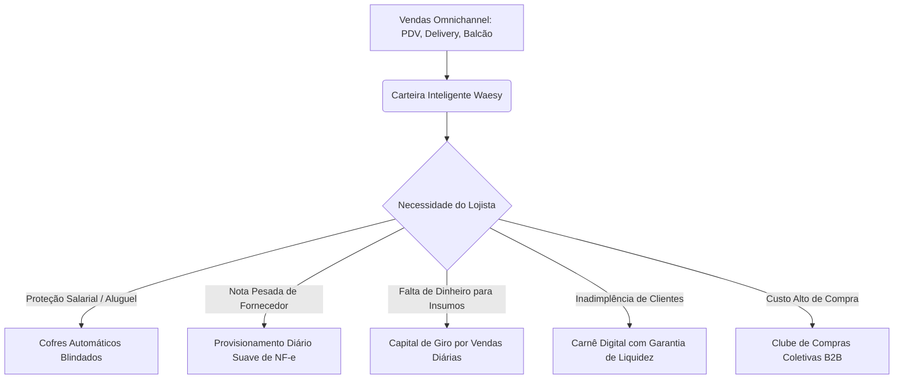

# Waesy Platform — Manual Canônico de Saúde Financeira, Proteção de Caixa & Finanças Humanas (Waesy Care Finance)

**Documento:** Doutrina de Apoio ao Fluxo de Caixa do Comércio Local  
**Classificação:** Fonte Única de Verdade de Regras de Negócio de Apoio Financeiro  
**Público-Alvo:** Pequenos Varejistas, Bares, Restaurantes, Clínicas, Prestadores de Serviços e Fornecedores  
**Filosofia Central:** *"A Waesy não é um banco que cobra; é o sócio protetor que não deixa o comerciante quebrar."*

---

## Sumário Executivo & Manifesto Humano

O maior drama do pequeno comerciante no Brasil — e especialmente no interior (Chapecó, São Miguel do Oeste, Meio-Oeste e Extremo Oeste de SC) — não é a falta de clientes ou de vontade de trabalhar: **é a asfixia do fluxo de caixa.**

Muitos empresários fecham as portas com as mesas cheias porque:
1. **Descasamento Temporal de Prazos:** A venda no cartão/carnê entra em 15 ou 30 dias, mas a folha salarial dos garçons/atendentes vence no dia 5 e o caminhão do fornecedor exige pagamento na entrega.
2. **Inadimplência do "Caderninho":** O crediário informal de confiança na vizinhança atrasa, deixando o dono do negócio sem dinheiro para a luz ou insumos.
3. **Falta de Previsibilidade:** O empreendedor não tem formação contábil e é pego de surpresa por boletos pesados de impostos ou duplicatas de fornecedores.
4. **Armadilha Bancária Tradicional:** Bancos convencionais cobram juros extorsivos no cheque especial (8% a 14% ao mês) e exigem garantias reais que o pequeno empresário não possui.

A **Waesy Care Finance** transforma a retenção de liquidação e a gestão de notas fiscais em um **escudo protetor** para o lojista, substituindo a pressão predatória por **segurança, capital de giro solidário, provisionamento suave e poder de compra cooperativado**.



---

## 1. Os 6 Pilares de Apoio Humano ao Fluxo de Caixa

---

### Pilar 1: Capital de Giro Automático por Vendas (Waesy Giro Solidário)
Em vez de um empréstimo bancário tradicional com parcela fixa que sufoca a loja nos meses de movimento fraco, a Waesy oferece crédito automático baseado no histórico de transações reais:

- **Concessão Instantânea:** Sem burocracia, sem fiador, sem certidão negativa. O limite é calculado pelo algoritmo de telemetria de vendas da loja na Waesy (ex: R$ 2.000 a R$ 30.000).
- **Amortização Flexível ("Retenção Suave"):** O pagamento não é um boleto no fim do mês. É um percentual fixo e leve descontado diretamente das vendas diárias da loja (ex: **8% a 12% do faturamento diário**).
  - Se na terça-feira a loja faturou R$ 500: desconta apenas R$ 50.
  - Se no sábado faturou R$ 3.000: desconta R$ 300 e quita mais rápido.
  - Se a loja fechar para reforma por 3 dias: **não há cobrança nem juros de mora**. O lojista respira.
- **Taxas Solidárias:** Custo financeiro transparente (1,2% a 1,8% a.m.), muito abaixo dos 8% a 15% praticados por adquirentes e bancos tradicionais.

---

### Pilar 2: Provisionamento Diário Suave de NF-e (O Fim do Baque do Boleto)
O maior pesadelo do dono de restaurante ou mercadinho é acordar na data de vencimento de uma duplicata de R$ 6.000 de carnes ou bebidas e não ter esse saldo na conta.

- **Como a Waesy resolve:**
  - O lojista vincula a chave de 44 dígitos da NF-e emitida pelo fornecedor (vencimento em 20 dias).
  - O sistema calcula o valor da parcela diária:
    $$\text{Reserva Diária} = \frac{\text{R\$ 6.000,00}}{20 \text{ dias}} = \mathbf{\text{R\$ 300,00 / dia}}$$
  - A Waesy separa automaticamente R$ 300 das vendas de cada dia e guarda na conta de liquidação daquela nota.
  - O lojista nem sente o peso da fatura saindo de uma vez só.
  - No dia do vencimento, **a nota é paga com 100% de pontualidade ao fornecedor, sem atraso, sem protesto em cartório e sem estresse**.
- **Micro-Complementação Emergencial:** Se no dia do vencimento faltarem até 15% do valor da nota por conta de chuvas ou dias atípicos, a Waesy complementa automaticamente a diferença via microcrédito rotativo com taxa zero por 7 dias, garantindo que o fornecedor não corte o envio de mercadorias.

---

### Pilar 3: Cofres Automáticos Blindados (Paz para Aluguel e Salários)
O lojista muitas vezes mistura o dinheiro das vendas com as despesas correntes e, quando chega o dia 5, falta dinheiro para o salário dos funcionários.

- **Cofre de Salários & Folha:** Reserva diária automática (ex: 15% das entradas) blindada contra saques impulsivos.
- **Cofre do Aluguel & Energia Elétrica:** Reserva calibrada para a data do vencimento do ponto comercial.
- **Rendimento em Conta:** Todo o dinheiro guardado nos cofres rende **100% a 105% do CDI diariamente**, gerando um ganho financeiro que o banco tradicional não repassa.
- **Liberação Humanizada:** Os cofres são liberados automaticamente no dia configurado para pagamento dos funcionários (via Pix em lote gratuito da Waesy) ou emissão do comprovante do aluguel.

---

### Pilar 4: Carnê Digital com Antecipação Solidária (Fim do Calote do Fiado)
No interior de Santa Catarina, 30% do comércio ainda opera no "caderninho" ou na confiança verbal, gerando inadimplência que quebra o caixa:

- **Digitalização do Crediário:** A compra parcelada é formalizada no Carnê Digital Waesy em 2 toques no celular do cliente.
- **Régua Amigável de WhatsApp:** Lembretes educados, automáticos e cordiais enviados com chave Pix no dia do vencimento, preservando o relacionamento comunitário entre vizinhos.
- **Liquidez Garantida para o Lojista:** Se o comerciante precisar de dinheiro para repor mercadoria antes do cliente pagar o carnê, a Waesy antecipa o valor líquido das parcelas a uma taxa cooperativa de 1,5%, assumindo a gestão da cobrança e liberando o comerciante do constrangimento de cobrar o cliente.

---

### Pilar 5: Central de Compras Coletivas B2B (Poder de Cooperativa Regional)
O pequeno lojista de São Miguel do Oeste ou Chapecó paga 20% a 30% mais caro em queijo, carnes, chopp, embalagens ou insumos do que uma grande rede de supermercados porque compra em pequenos volumes.

- **União de Demanda no Hub Waesy:**
  - A Waesy agrega a necessidade de 100 pizzarias, 50 hamburguerias e 80 padarias da região.
  - O sistema negocia diretamente com indústrias e cooperativas da região (Aurora, Cooperalfa, Moinhos, fabricantes de embalagens de SC) pedidos em escala industrial.
- **Desconto Repassado ao Lojista:** Redução direta de **18% a 35% no custo das mercadorias**.
- **Pagamento com Saldo Futuro da Loja:** A compra coletiva de insumos pode ser paga com as próprias vendas futuras que o restaurante fará na Waesy.

---

### Pilar 6: Assistente Preditivo de Caixa (Linguagem Simples & Acolhedora)
Chega de dashboards financeiros corporativos indecifráveis que geram ansiedade. A Waesy se comunica como um gerente de confiança do interior:

```
┌─────────────────────────────────────────────────────────────────────────────┐
│ 🛡️ RADAR DE TRANQUILIDADE FINANCEIRA DA SUA LOJA                             │
├─────────────────────────────────────────────────────────────────────────────┤
│ "Olá, Eduardo! Seu caixa está seguro pelos próximos 14 dias."               │
│                                                                             │
│ 📅 Próximo Compromisso: Nota Frimesa/Aurora (R$ 2.400) vence em 4 dias.     │
│ 💰 Situação da Reserva: Já guardamos R$ 1.950 suavemente das suas vendas.   │
│ ✨ Projeção: Com o movimento de hoje e amanhã, você pagará a nota com folga│
│    e ainda terá R$ 1.100 livres na carteira.                                │
│                                                                             │
│ [Ver Detalhes da Nota]              [Antecipar R$ 500 do Carnê (Taxa Zero)] │
└─────────────────────────────────────────────────────────────────────────────┘
```

---

## 2. Modelagem de Dados & Regras de Negócio de Apoio Financeiro

### 2.1. Entidades de Domínio (Tabelas do Banco)

```text
StoreCashSafe (Cofres Inteligentes de Proteção)
  ├── id (uuid, PK)
  ├── store_id (uuid, FK -> stores)
  ├── name (text: "Salários da Equipe", "Aluguel", "Reserva de Emergência")
  ├── target_amount_cents (bigint)
  ├── current_amount_cents (bigint)
  ├── auto_split_percentage (numeric 4,2: ex 10.00%)
  ├── unlock_date (date: ex dia 5 de cada mês)
  ├── status (active | paused | unlocked)
  └── created_at / updated_at (timestamptz)

StoreWorkingCapitalAdvance (Giro Solidário por Vendas)
  ├── id (uuid, PK)
  ├── store_id (uuid, FK -> stores)
  ├── approved_amount_cents (bigint)
  ├── outstanding_balance_cents (bigint)
  ├── daily_sales_deduction_rate (numeric 4,2: ex 10.00%)
  ├── monthly_interest_rate (numeric 4,2: ex 1.50%)
  ├── status (active | settled | renegotiated)
  ├── disbursed_at (timestamptz)
  └── created_at / updated_at (timestamptz)

SupplierInvoiceSplitSchedule (Provisionamento Suave de NF-e)
  ├── id (uuid, PK)
  ├── store_id (uuid, FK -> stores)
  ├── inbound_invoice_id (uuid, FK -> store_inbound_invoices)
  ├── daily_reserve_cents (bigint)
  ├── total_reserved_cents (bigint)
  ├── target_due_date (date)
  ├── auto_pay_enabled (boolean: true)
  ├── emergency_advance_cents (bigint, default 0)
  └── status (accumulating | ready_to_pay | paid | defaulted)
```

---

## 3. A Vantagem Competitiva Insuperável: O Lojista Ama a Waesy

Quando a plataforma deixa de ser apenas uma "cobradora de comissões" e passa a ser o **anjo da guarda do fluxo de caixa**:

1. **Churn (Cancelamento) Quase Zero:** O lojista nunca troca a Waesy pelo iFood ou Amo Ofertas, porque o concorrente só arranca 15% dele e não ajuda a pagar a conta de luz no dia fraco.
2. **Engajamento Orgânico B2B:** Os lojistas recomendam a plataforma ativamente para outros empresários da cidade ("A Waesy organiza meu aluguel e não deixa faltar dinheiro para o fornecedor").
3. **Multiplicação de Receita Saudável:** A Waesy passa a capturar receitas de microcrédito solidário, spread do CDI do float e taxas de fornecedores, multiplicando o faturamento sem explorar a ponta comercial.

---

*Documento canônico auditado e aprovado pelo Conselho Executivo de BigTech da Waesy.*
