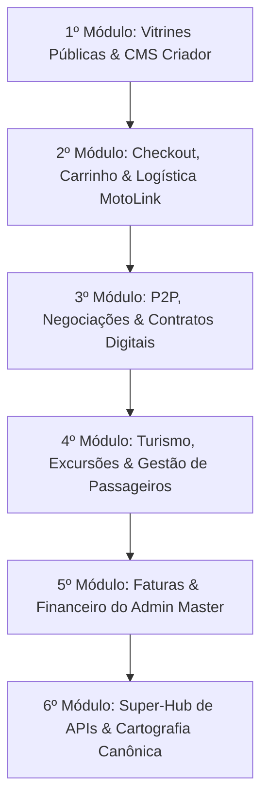

# MASTER FLOWS AUDIT — Auditoria Recursiva, Matriz de Requisitos & Mapeamento de Gaps da Plataforma Waesy

> **Conselho Executivo de Engenharia de BigTech (Apple, Stripe, Airbnb, Linear & iFood)**  
> **Status:** Ativo & Vinculante  
> **Referência:** `AGENTS.md`, `DESIGN.md`, `ROADMAP.md`, `MEGA_PROMPT_BIGTECH_MASTER_PLAN.md`  
> **Padrão de Qualidade:** Completude Séptupla (Banco de Dados ➔ BFF & Contratos ➔ UI de Ação ➔ Governança ➔ Silêncio Visual ➔ Ergonomia dos 3 Toques ➔ Fluidez & Zero Layout Shift).

---

## 🏛️ 1. O Protocolo das 7 Camadas de Completude Invioláveis

Nenhuma funcionalidade ou fluxo nesta plataforma é considerado concluído sem a satisfação rigorosa e verificável das 7 Camadas:

| Camada | Escopo | Critério de Aceite |
|---|---|---|
| **Camada 1: Banco de Dados** | Tabelas, tipos enums, foreign keys, índices compostos, constraints e RLS Deny-by-Default. | Migrations versionadas no Git, RLS com isolamento multi-tenant rígido (`store_id`, `organization_id`), integridade referencial ACID. Proibição total de colunas órfãs ou tabelas sem índices em chaves de busca. |
| **Camada 2: BFF & Contratos** | Server Functions (`createServerFn`) no TanStack Start com validação de esquemas Zod estritos. | Derivação de autoridade pela sessão segura (`getServerIdentity`), transações atômicas (`.rpc`), zero dependência de IDs ou tenant passados cegamente pelo cliente em operações destrutivas. |
| **Camada 3: UI de Ação** | Componentes interativos com feedback de latência zero, estados de loading, erro e validação. | Formulários, Sheets e Modais com tratamento gracioso de falhas, botões com feedback imediato, zero travamento de thread visual e prevenção de duplo clique. |
| **Camada 4: Superfície de Governança** | Painéis operacionais de gestão no Workspace da Loja ou no Admin Master da Plataforma. | Toda ação executada pelo usuário gera um rastro auditável e manipulável pelo operador ou administrador (aprovação, cancelamento, estorno, visualização de contrato, reemissão). |
| **Camada 5: Silêncio Visual & Anti-AI Smell** | Eliminação de jargões técnicos, caixas conversacionais prolixas e decorações redundantes. | Padrão Apple/Stripe: títulos diretos, ausência de cartões explicativos do óbvio ("Bem-vindo ao..."), tipografia limpa com tokens semânticos (`var(--color-*)`), zero emojis decorativos, zero cores hardcoded. |
| **Camada 6: Ergonomia dos 3 Toques** | Conclusão do objetivo primário (compra, agendamento, proposta) em no máximo 3 toques do polegar. | Ações primárias fixas no terço inferior da tela móvel (`Thumb Zone`), touch targets mínimos de 44x44px (`h-11` a `h-12`), preenchimento inteligente e dados salvos no perfil. |
| **Camada 7: Fluidez & Zero Layout Shift** | Prevenção de FOUC, layout estável, containers padronizados e margens canônicas de 1px. | Margem móvel de exatamente 1px (`px-[1px]`), proibição de margens duplas, containers consistentes (`max-w-5xl`/`max-w-6xl`), 0 erros de build (`npm run build`) e 0 erros de tipo (`npm run typecheck`). |

---

## 🗺️ 2. Sequenciamento de Execução dos 6 Macro-Módulos

Definido pelo alinhamento executivo no `/grill-me`, o roteiro de implementação segue a **Ordem da Jornada do Usuário**:

---

## 📦 3. Detalhamento dos 6 Macro-Módulos & Matriz de Requisitos (Consolidação /grill-me)

---

### 🌐 MÓDULO 1: Vitrines Públicas de Descoberta & CMS Criador de Anúncios

#### 1. Visão do Módulo
Garantir paridade 1:1 absoluta entre os campos cadastrados no CMS (`_store.conta.classificados.novo.tsx`) e a renderização na vitrine pública (`universal-classified-showcase.tsx`, `editorial-showcase-view.tsx`), eliminando fallbacks silenciosos ou mocks de dados, estruturado no modelo de Wizard em 5 etapas adaptativas.

#### 2. Matriz de Requisitos
- **`[REQ-01]` Wizard Adaptativo em 5 Etapas no CMS:**
  - **Etapa 1 — Nicho & Tipo de Operação:** Seleção visual direta com chips semânticos (`goods`, `vehicle`, `real_estate`, `hospitality_stay`, `service`, `job`, `food`, `donation`, `travel`).
  - **Etapa 2 — Especificações Técnicas do Nicho:** Formulário flexível com **Barra de Score de Qualidade** (incentivo à completude sem bloqueios frustrantes) e preenchimento assistido (CEP autocompleta endereço e chips rápidos para câmbio/combustível). Campos vazios são omitidos na vitrine sem ruído.
  - **Etapa 3 — Mídia & Galeria com Proporção Travada:** Upload múltiplo com cropper travado na proporção canônica do nicho (4:3 para galeria geral, 21:9 para banner de turismo, 9:16 para stories). A primeira foto vira automaticamente a principal com anel sutil monocromático (`ring-1 ring-primary/40`), **sem badges ou estrelas decorativas**, em total silêncio visual. Suporte a tour em vídeo curto (até 60s).
  - **Etapa 4 — Condições Comerciais & Pagamento:** Preset padrão inteligente pelo nicho exibido de forma limpa + botão silencioso "Personalizar condições comerciais" que abre switches adaptativos ("Compra imediata", "Aceita propostas P2P", "Aceita trocas", "Entrega MotoLink") e slider de parcelamento (1x a 24x).
  - **Etapa 5 — Truthful Preview & Publicação:** Renderização real e idêntica à vitrine com alternador limpo de abas de texto ("Mobile" / "Desktop", sem emojis), indicador de score final, botão "Publicar Anúncio" fixo no Thumb Zone e redirecionamento com Modo Proprietário ativo.
- **`[REQ-02]` Rascunhos Híbridos (Drafts):** Salvamento automático a cada etapa no banco de dados (`status='draft'`) e backup no `localStorage`. Ao acessar o criador de qualquer dispositivo, o usuário visualiza o card de rascunho com botão direto de "Retomar Criação (Etapa X de 5)".
- **`[REQ-03]` Paridade 1:1 de Dados (Zero Silent Fallbacks):** Proibição total de dados inventados via operadores `||` na visualização (ex: duração de viagem, ano de veículo, metragem de imóvel). Se o campo estiver vazio no banco, renderizar Empty State discreto ou omitir a linha.
- **`[REQ-04]` Modo Proprietário na Vitrine:** Identificação segura do anunciante (`isOwner`) exibindo barra discreta monocromática com botão "Editar Anúncio", status do anúncio e uploaders contextuais de mídia inline.

---

### 🛒 MÓDULO 2: Checkout, Carrinho & Logística MotoLink

#### 1. Visão do Módulo
Permitir a compra fluida de produtos e serviços locais em no máximo **3 toques**, com cálculo dinâmico de entrega urbana e checkout nativo em Bottom Sheet no mobile.

#### 2. Matriz de Requisitos
- **`[REQ-05]` Drawer / Bottom Sheet de Checkout em 3 Toques no Mobile:**
  - *Toque 1:* Seleção rápida do endereço salvo (ou retirada presencial).
  - *Toque 2:* Seleção do método de pagamento (Pix Instantâneo ou Cartão de Crédito).
  - *Toque 3:* Botão de confirmação atômica com bloqueio preventivo de duplo clique.
  - No desktop: Layout limpo em duas colunas com resumo sticky lateral.
- **`[REQ-06]` Apresentação Silenciosa de Logística MotoLink & Surge Pricing:** Cálculo server-side de frete (tarifa base + km + multiplicadores de chuva via Open-Meteo/wttr.in e pico de demanda). Exibição direta e elegante: `"MotoLink Expressa · 25-35 min · R$ 12,00"`, com linha fina neutra caso haja tarifa dinâmica, sem ícones alarmistas nem caixas coloridas.
- **`[REQ-07]` Reserva de Estoque Atômica com Timeout de 15 Minutos:** Transação atômica `.rpc` que bloqueia o estoque dos itens por 15 minutos enquanto aguarda a liquidação do Pix. A tela final exibe QR Code nítido, código Copia e Cola com botão de 1 toque e temporizador regressivo silencioso. Após 15 minutos sem pagamento, o estoque é destravado e o pedido é cancelado.
- **`[REQ-08]` Linha do Tempo de Rastreamento em Tempo Real:** Tracking transparente do pedido (Aguardando Confirmação ➔ Em Preparação ➔ Saiu para Entrega / MotoLink a Caminho ➔ Entregue).

---

### 🤝 MÓDULO 3: P2P, Negociações & Contratos Digitais

#### 1. Visão do Módulo
Formalização jurídica e comercial de acordos entre membros (vendas de usados, locações de temporada, prestação de serviços), com assinatura tátil no celular, geração de contratos com hash criptográfico SHA-256 e liquidação financeira direta entre as partes.

#### 2. Matriz de Requisitos
- **`[REQ-09]` Assinatura Tátil no Celular (Touch Canvas) & Hash SHA-256:** As partes desenham a rubrica com o dedo na tela móvel. O sistema registra IP, navegador e carimbo de data/hora, gerando o PDF formal com o contrato assinado e termos adaptados ao tipo de negociação, com custo zero de APIs externas.
- **`[REQ-10]` Cartão Digital de Acompanhamento 9:16:** Geração do `DigitalCompanionCard` formatado para envio direto no WhatsApp com resumo do acordo, contatos de emergência e regras acordadas.
- **`[REQ-11]` Canal de Chat P2P Reativo:** Criação e sincronização automática de thread em `chat_threads` com notificações instantâneas em qualquer evento da proposta (envio, contraproposta, aceite, recusa, cancelamento ou conclusão).
- **`[REQ-12]` Confirmação Bilateral e Pagamento Direto:** Pagamento via Pix realizado diretamente entre comprador e anunciante (zero custódia ou retenção pela plataforma). O comprador confirma o recebimento na sua conta (`/conta/negociacoes`), concluindo o ciclo da proposta.

---

### 🚌 MÓDULO 4: Turismo, Excursões & Gestão de Passageiros

#### 1. Visão do Módulo
Experiência completa para agências de turismo e excursões, combinando vitrine editorial estilo Instagram com mapa interativo de poltronas no Workspace, gestão de rooming list e bilhete digital do passageiro com QR code.

#### 2. Matriz de Requisitos
- **`[REQ-13]` Mapa Interativo Visual de Ônibus no Workspace (`/workspace/turismo`):** Painel gráfico com corte esquemático do ônibus (46 lugares ou Double Decker); a agência arrasta ou aloca passageiros da lista para suas respectivas poltronas com validação de passageiros menores de idade.
- **`[REQ-14]` Bilhete Digital com Poltrona em Tempo Real (`/conta/ingressos`):** Assim que a agência aloca o assento, o voucher digital do passageiro é atualizado instantaneamente exibindo o número da poltrona (`Poltrona 14 · Piso Superior`) e QR Code legível para bipagem pelo guia no embarque.
- **`[REQ-15]` Gestão de Rooming List de Hospedagem:** Organização de viajantes por apartamentos (Casal, Duplo Solteiro, Triplo, Família) com exportação em 1 clique em PDF e planilha formatada para a recepção do hotel.
- **`[REQ-16]` Emissão do Manifesto de Embarque Oficial da ANTT:** Geração em 1 clique do documento regulatório oficial em PDF contendo dados completos dos viajantes (Nome, RG/Órgão, CPF, Data de Nascimento, Telefone, Poltrona e Contato de Emergência).

---

### 💳 MÓDULO 5: Faturas & Financeiro do Admin Master & Workspace

#### 1. Visão do Módulo
Modelo econômico limpo e sustentável baseado em **Taxa Zero nas Vendas (0% take rate nos pedidos)**, com monetização exclusiva por mensalidade de software (SaaS fixo) e micro-tokens, com faturamento automático no Admin Master.

#### 2. Matriz de Requisitos
- **`[REQ-17]` Taxa Zero nas Vendas Locais:** A loja recebe 100% do valor de suas vendas diretamente na sua conta conectada do gateway adquirente, eliminando bitributação e riscos de custódia para a plataforma.
- **`[REQ-18]` Faturamento Mensal SaaS & Micro-Tokens (`/admin-master/faturas`):** Geração automática de faturas mensais de software para os lojistas ativos, com cobrança via Pix e Boleto bancário e conciliação de liquidação.
- **`[REQ-19]` Painel de Assinatura & Faturas no Workspace do Lojista:** Visualização limpa do plano contratado, faturas em aberto, comprovante de quitação e histórico de pagamentos.
- **`[REQ-20]` Dashboard de MRR & Inadimplência no Admin Master:** Telemetria centralizada de receita recorrente mensal (MRR), total de lojas assinantes, faturas pendentes e histórico fiscal em centavos inteiros (Integer Cents BRL).

---

### 🔌 MÓDULO 6: Super-Hub de APIs & Cartografia Canônica

#### 1. Visão do Módulo
Infraestrutura mestre de dados externos, geolocalização e telecomunicações gerenciada centralmente no Admin Master, com consumo de provedores abertos, cache inteligente e alta disponibilidade.

#### 2. Matriz de Requisitos
- **`[REQ-21]` Gestão Centralizada no Admin Master (`/admin-master/integracoes`):** Painel unificado de monitoramento de saúde (Active, Degraded, Down), latência e quotas de provedores, com suporte a credenciais privadas para clientes Enterprise.
- **`[REQ-22]` Cartografia Oficial OpenStreetMap & Leaflet/Nominatim:** Geocodificação real sem dependência de serviços pagos ou marcas d'água concorrentes, com cálculo de rotas e coordenadas reais de estabelecimentos.
- **`[REQ-23]` Previsão do Tempo Real (Open-Meteo / wttr.in):** Widget meteorológico consumindo API real de clima para a cidade de destino em pacotes turísticos e eventos, com cache de 30 minutos.
- **`[REQ-24]` Cotação Cambial Comercial em Tempo Real (AwesomeAPI):** Câmbio comercial (Dólar, Euro, Peso) atualizado de hora em hora para orçamentos e viagens internacionais.
- **`[REQ-25]` Cache Inteligente & Fallbacks Defensivos:** Estratégia de cache multinível (Câmbio 1h, Clima 30min, CEP permanente) prevenindo rate-limits e garantindo que quedas de conectividade externa nunca quebrem a interface.

---

## 📈 4. Rastreabilidade & Próximas Ações

Com as diretrizes executivas alinhadas e consolidadas através do `/grill-me`, o avanço da engenharia segue os Planos de Execução atômicos e progressivos:

1. **Plano de Execução 1:** *Módulo 1 — Vitrines & CMS Criador de Anúncios*
2. **Plano de Execução 2:** *Módulo 2 — Checkout, Carrinho & Logística MotoLink*
3. **Plano de Execução 3:** *Módulo 3 — P2P, Negociações & Contratos Digitais*
4. **Plano de Execução 4:** *Módulo 4 — Turismo, Excursões & Gestão de Passageiros*
5. **Plano de Execução 5:** *Módulo 5 — Faturas & Financeiro do Admin Master*
6. **Plano de Execução 6:** *Módulo 6 — Super-Hub de APIs & Cartografia Canônica*

---

> *Documento ratificado pelo Conselho Executivo de Engenharia de BigTech da Plataforma Waesy.*
