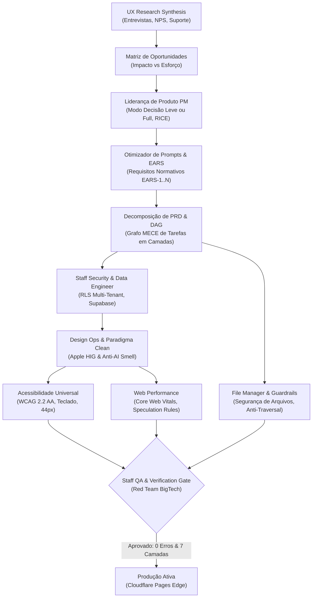

# Ciclo de Vida Autônomo de Produto & Engenharia BigTech (Waesy Platform)

> **Single Source of Truth (SSOT)** para o fluxo integrado de ponta a ponta da plataforma Waesy.
> Conecta todas as skills do Conselho Executivo de BigTech em uma esteira de entrega contínua sem quebras, sem mocks e com zero retrabalho.

---

## 🏛️ 1. O Grafo Unificado de Valor (Pipeline E2E)

---

## 🔄 2. As 4 Fases Integradas & Responsabilidades de Cada Skill

### Fase 1: Descoberta, Decisão & Engenharia de Requisitos
1. **`ux-research-synthesis`:**
   - Coleta dados empíricos brutos (entrevistas, tickets, notas NPS).
   - Separa rigorosamente fatos observáveis de interpretações.
   - Gera a matriz Insights ➔ Oportunidades categorizadas por Impacto e Esforço.
2. **`pm` (Product Manager Autônomo):**
   - Recebe a demanda e define o contexto de decisão (Objetivo, Última Decisão, Maior Restrição).
   - Aplica priorização por RICE (`Reach x Impact x Confidence / Effort`).
   - Modula o tom: *Modo Decisão Leve* (fundador solo) ou *Modo Formato Completo* (PRD estruturado).
3. **`prompt-optimizer` (Metodologia EARS):**
   - Transforma requisitos informais em declarações normativas estritas:
     - Ubíquo, Orientado a Eventos, Impulsionado por Estado, Condicional e Comportamento Indesejado.
   - Rejeita adjetivos subjetivos ("fácil", "rápido") e exige critérios numéricos testáveis.

### Fase 2: Arquitetura, Contratos & Governança de Persistência
1. **`decompose-prd` (DAG de Tarefas MECE):**
   - Decompõe o PRD na hierarquia de 3 níveis: Épicos ➔ Funcionalidades ➔ Tarefas executáveis.
   - Gera o Grafo Acíclico Dirigido (DAG) em camadas de paralelismo (Layer 0, 1, 2) e identifica o caminho crítico.
   - Calibra cada tarefa no orçamento ótimo de 2000–4000 tokens.
2. **`security-guard` & `supabase-postgres-best-practices`:**
   - Modela o banco em integer cents BRL, chaves estrangeiras, índices e RLS deny-by-default multi-tenant (`store_id`, `organization_id`).
   - Define os contratos BFF (`createServerFn`) tipados com Zod e autorização por sessão.
3. **`file-manager`:**
   - Valida segurança de caminhos contra path traversal (`../`) e blacklist de sistema (`/System`, `C:\Windows`, `.git/`, `.env*`).
   - Organiza arquivos gerados nas pastas canônicas (`Documents/`, `Images/`, etc.) e assegura quarentena controlada.

### Fase 3: Superfície de Gestão, Acessibilidade & Performance
1. **`design-ops`, `apple-design` & `anti-ai-design`:**
   - Aplica o Paradigma Clean nas áreas operacionais e o Editorial Zine na vitrine pública.
   - Erradica AI smell (sem caixas conversacionais prolixas, botões diretos de ação, touch targets de 44px).
2. **`accessibility` (WCAG 2.2 AA):**
   - Contraste de cor mínimo de 4.5:1 em textos normais e 3:1 em elementos de UI.
   - Navegação 100% por teclado com foco visível e sem armadilhas.
   - Associação explícita de rótulos (`<Label htmlFor>`) e atributos ARIA semânticos.
3. **`web-performance` (Core Web Vitals):**
   - Respeita o orçamento de desempenho: peso < 1.5MB, JS < 300KB, imagens Hero < 500KB.
   - Ativa View Transitions nativas (`@view-transition { navigation: auto; }`) e Speculation Rules API para navegação instantânea.
   - Elimina layout thrashing com loteamento de leituras e escritas de DOM.

### Fase 4: Auditoria do Red Team, Prova de Runtime & Produção
1. **`bigtech-board` (Verification Gatekeeper):**
   - Executa a auditoria de Completude Séptupla:
     - 1. Banco (Migration + RLS) ➔ 2. BFF (Zod + Sessão) ➔ 3. UI (Feedback real) ➔ 4. Gestão (Painel no Workspace) ➔ 5. Anti-AI Smell ➔ 6. 3 Toques ➔ 7. Zero Layout Shift.
   - Proibição absoluta de mocks ou toasts fictícios sem persistência.
2. **`proof-verifier` & Runtime Proof:**
   - Validação de compilação sem erros no TypeScript (`npm run build`).
   - Validação da suíte de testes automatizados com 100% de sucesso no Vitest.
   - Deploy ativo na Cloudflare Pages.
