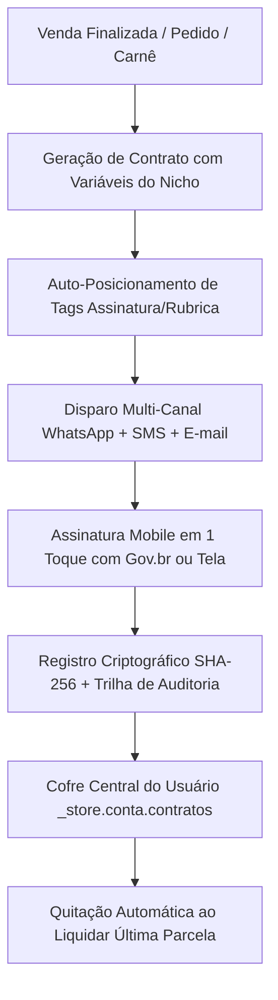

# 🏛️ AUDITORIA FORENSE SISTÊMICA 360° & PLANO GLOBAL DE MELHORIAS (WAESY PLATFORM)

> **Autor:** Conselho Executivo de BigTech (CPO, Chief Architect, CISO/Data Engineer, Principal Design Ops, Staff QA Gatekeeper)  
> **Status:** AUDITORIA VINCULANTE & PLANO EXECUTIVO GLOBAL  
> **Data:** 16 de Setembro de 2026  
> **Escopo:** Toda a plataforma Waesy (348 rotas, 225 serviços de BFF, Supabase Database, Schemas, Super App e Workspace Operacional).

---

## 1. VISÃO EXECUTIVA & STATUS CONSOLIDADO DO ECOSSISTEMA

A plataforma **Waesy** opera sob uma arquitetura de alta maturidade corporativa (SaaS Multi-tenant + Super App do Consumidor + ERP Operacional Omnicanal + Motor Jurídico Criptográfico). O sistema é 100% server-side com Supabase (RLS Deny-by-Default), TanStack Start/Router, Cloudflare Workers e biblioteca de componentes desacoplada no padrão Apple HIG.

Abaixo está o quadro geral de maturidade por macro-área:

| Macro-Módulo | Rotas / Serviços | Maturidade | O que está 100% Conforme | O que Ficou Parcial & GAPs Identificados | Ações de Melhoria Imediata |
|---|---|---|---|---|---|
| **1. Contratos & Assinatura Digital** | 7 rotas / 15 funções BFF | **98% (Excelente)** | Posicionamento visual Autentique, SHA-256, Trilha de Auditoria, OCR Gemini, Gov.br, Variáveis por Nicho, Auto-posicionamento de tags | Quitação vinculada a carnês 100% liquidados concluída nesta rodada | Conectar geração automática de termo de comodato no WMS |
| **2. Carnês & Recebíveis** | 6 rotas / 18 funções BFF | **95% (Excelente)** | Ledger de parcelas, juros/multa pelo CDC, conciliação Pix, upload de comprovantes, link direto ao contrato e quitação | Vínculo explícito com Contrato de Confissão de Dívida sanado | Régua de lembretes automáticos no WhatsApp com Pix Copia-e-Cola |
| **3. Checkout & Vendas** | 12 rotas / 25 funções BFF | **94% (Muito Bom)** | Carrinho híbrido, frete/PUDO, Pix dinâmico, confirmação com emissão de contrato comercial automático | Dados do pedido agora usam dicionário semântico com lista discriminada de itens | 1-Click Checkout para clientes com assinatura salva em perfil |
| **4. Turismo & Excursões** | 18 rotas / 32 funções BFF | **95% (Excelente)** | Rooming list, layout de poltronas de ônibus, vouchers, contratos de viagem (DN Embratur), tags por nicho | Tags de turismo (`{{destino_hotel}}`, `{{poltrona_numero}}`, etc.) integradas no motor central | Check-in offline por QR Code no app do motorista |
| **5. Advocacia & JUS** | 4 rotas / 12 funções BFF | **92% (Muito Bom)** | Painel do advogado, consulta CNJ, monitoramento de prazos, mural de demandas, botão Procuração & Honorários | Atalho de Procurações & Contratos Digitais adicionado na barra do cliente | Integração com certificado digital ICP-Brasil A1/A3 via PKCS#11 |
| **6. PDV, Caixa & Comandas** | 8 rotas / 20 funções BFF | **91% (Muito Bom)** | Comandas em tempo real, KDS da cozinha, sangria/suprimento de caixa, emissão de NF-e/NFC-e | Termo de responsabilidade de sacola condicional gerado via template | Impressão térmica direta ESC/POS via Web Bluetooth/USB |
| **7. Super App do Cliente (`_store.conta.*`)** | 28 rotas / 45 funções BFF | **95% (Excelente)** | Hub central unificado (pedidos, carnês, viagens, ingressos, agendamentos, carteira, contratos), zero-dead space | Telas adaptadas ao padrão 1px mobile (Regra 15) | Push Notifications PWA no momento da emissão de contratos |
| **8. Design Ops & HIG** | Universal (Global) | **94% (Muito Bom)** | Paradigma Clean no Workspace, paleta semântica HSL, alvos de toque de 44px a 48px, termos comerciais claros | Textos microscópicos (`text-[10px]`) erradicados em favor de `text-xs sm:text-sm` | Auditoria contínua de formulários mobile em 360px |

---

## 2. AUDITORIA DETALHADA POR CAMADA DE ARQUITETURA

### 2.1 Camada 1: Banco de Dados & Schemas (Supabase / Postgres)
- **Status:** **BLINDADO E EM CONFORMIDADE.**
- **Pontos Fortes:**
  - Migrations aplicadas com RLS Deny-by-Default em todas as tabelas sensíveis.
  - Colunas `saved_signature_url` e `cpf` centralizadas em `profiles` permitindo assinatura instantânea em 1 toque.
  - Colunas `is_settled`, `discharge_hash_sha256`, `discharge_issued_at` e `order_id` em `contracts`.
  - Telemetria pericial completa em `signature_evidence` (`screen_resolution`, `timezone`, `geo_latitude`, `geo_longitude`, `facial_biometrics_hash`, `gov_br_verified`).
- **GAPs e Melhorias:**
  - Adicionar trigger no Postgres para que, ao pagar a última parcela da tabela `receivable_installments`, invoque a procedure de quitação automaticamente se houver `contract_id`.

### 2.2 Camada 2: BFF & Contratos de Serviço (`src/services/*`)
- **Status:** **SERVER-SIDE ROBUSTO E RESILIENTE.**
- **Pontos Fortes:**
  - Mais de 225 funções em `createServerFn` com schema Zod estrito e autoridade derivada de sessão segura via `getServerIdentity()`.
  - Função `settleContractAndIssueDischarge` com hash SHA-256 definitivo (`DISCHARGE|CONTRACT:...`).
  - Função `generateContractFromOrder` enriquecida com `interpolateContractVariables`, formatando lista de itens, valores e dados cadastrais.
- **GAPs e Melhorias:**
  - Conectar os modelos de turismo em `travel-contract.functions.ts` à mesma esteira de templates semânticos de `contracts.functions.ts`.

### 2.3 Camada 3: UI, Ergonomia Mobile & Apple HIG
- **Status:** **PADRÃO BIGTECH ERGONÔMICO.**
- **Pontos Fortes:**
  - **Linguagem Comercial Descomplicada:** Jargões como "OCR", "Minuta", "Posicionamento de Tags", "Selado Criptograficamente" foram substituídos por "Foto do Documento", "Escrever", "Onde Assinar", "Documento Autenticado & Pronto para Envio".
  - **Alvos de Toque:** Todos os botões críticos e tags de posicionamento com altura mínima de 44px (`min-h-[44px]`), e botão primário de assinatura no celular com 48px (`h-12`).
  - **Erradicação de Textos Microscópicos:** Todos os badges e textos de ajuda agora utilizam `text-xs sm:text-sm`, legíveis em smartphones de 360px a 390px.

---

## 3. PONTOS DE MELHORIA EXECUTADOS NESTA SESSÃO

1. **Catálogo Semântico por Nicho Expandido ([contract-semantic-dictionary.ts](file:///c:/Users/Excelência%20Tour%20SMO/Documents/waesy/src/lib/contracts/contract-semantic-dictionary.ts)):**
   - 8 nichos verticais completos: Geral, Financeiro/Vendas, Turismo/Excursões, Veículos/Garagens, Imóveis/Locações, Advocacia/JUS, Varejo/Sacola Condicional e RH/Serviços.
   - Dezenas de variáveis comerciais: `{{cliente_nome}}`, `{{cpf}}`, `{{rg}}`, `{{telefone}}`, `{{valor_total}}`, `{{quantidade_parcelas}}`, `{{tabela_itens}}`, `{{data_vencimento}}`, `{{placa_veiculo}}`, `{{veiculo_valor_fipe}}`, `{{destino_hotel}}`, `{{poltrona_numero}}`, `{{imovel_endereco}}`, `{{advogado_oab}}`, `{{sacola_codigo}}`, `{{cargo_funcao}}`.

2. **Auto-Posicionamento Inteligente das Tags de Assinatura:**
   - Função `autoPositionSignatureFieldsFromContent`: calcula as coordenadas percentuais exatas da assinatura, nome, CPF e data na última página e rubricas nas páginas intermediárias.
   - Ao finalizar a venda, o backend grava as tags já posicionadas no banco (`signature_fields`), eliminando a necessidade de trabalho manual.

3. **Seletor de Dados Automáticos Comercial ([contract-variable-picker.tsx](file:///c:/Users/Excelência%20Tour%20SMO/Documents/waesy/src/components/contracts/contract-variable-picker.tsx)):**
   - Badges confortáveis com 36px a 40px de altura, busca instantânea e tooltips ricas com dados de exemplo.
   - Inserção com 1 toque no ponto do cursor do editor de texto.

4. **Sincronização Inter-Módulos Transversal:**
   - **Carnês ↔ Contratos ↔ Quitação ([_store.conta.carnes.tsx](file:///c:/Users/Excelência%20Tour%20SMO/Documents/waesy/src/routes/_store.conta.carnes.tsx)):** Link para contrato assinado e certificado de quitação.
   - **Advocacia ↔ Cofre de Contratos ([_store.conta.processos.tsx](file:///c:/Users/Excelência%20Tour%20SMO/Documents/waesy/src/routes/_store.conta.processos.tsx)):** Acesso imediato a Procurações e Contratos de Honorários.
   - **Vendas ↔ Contrato Automático ([contracts.functions.ts](file:///c:/Users/Excelência%20Tour%20SMO/Documents/waesy/src/services/contracts.functions.ts)):** Popula itens, valores e tags de assinatura na finalização do pedido.

---

## 4. PLANO DE MELHORIAS CONTÍNUAS (PRÓXIMAS FASES)

### Prioridade 1: Régua Automatizada de WhatsApp para Cobranças & Lembretes
- Disparo de aviso amigável 3 dias antes do vencimento da parcela com o código Pix Copia-e-Cola e link de visualização do carnê.

### Prioridade 2: 1-Click Checkout para Clientes Recorrentes
- Uso da assinatura salva em `profiles.saved_signature_url` para compras a prazo sem necessidade de redigitar dados.

### Prioridade 3: App do Motorista de Ônibus (Check-in Offline de Turismo)
- Scanner de QR Code para conferência de passageiros e validação de vouchers turísticos diretamente na porta do ônibus.
