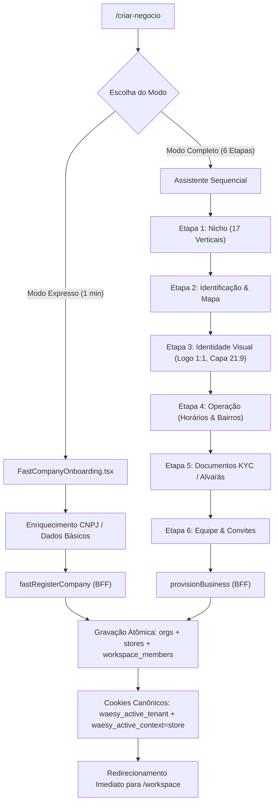

# 02-fluxo-marca.md — Fluxo da Empresa Passo a Passo & Pontos de Rompimento

| Dimensão | Especificação |
| :--- | :--- |
| **Módulo** | Criação, Edição & Provisionamento de Marca/Workspace |
| **Entrada** | `/criar-negocio` |
| **Saída Esperada** | Workspace funcional em `/workspace` com alternador ativo |

---

## 1. Passo a Passo da Jornada de Criação

---

## 2. Pontos de Rompimento Auditados & Mitigações

### Rompimento 1 (MB1 / MB3) — Disparidade de Cookies no Modo Expresso
- **Onde ocorria:** Em `src/services/company-mvp.functions.ts` (`fastRegisterCompany`), a função definia apenas o cookie `waesy_store_id`, enquanto o resolvedor de tenant SSR (`src/lib/tenant.server.ts`) escuta exclusivamente `waesy_active_tenant`.
- **Sintoma:** O usuário criava a empresa no modo expresso, era enviado para `/conta/empresa`, mas ao tentar acessar o `/workspace`, era rejeitado ou o tenant vinha nulo.
- **Causa Raiz:** Nomenclatura divergente de cookies herdada de protótipos legados.
- **Mitigação Instalada:** Unificação estrita em `fastRegisterCompany` para definir `waesy_active_tenant`, `waesy_active_context=store`, `waesy_store_id` e limpar `waesy_active_creator`.

### Rompimento 2 (MB2) — Workspace Órfão ou sem Vínculo de Administrador
- **Onde ocorria:** Se o bloco `workspace_members` sofresse falha silenciosa durante a criação da loja, a loja era persistida em `stores`, mas sem registro de membro.
- **Sintoma:** A loja existia no banco de dados, porém não aparecia em `session.memberships` e o usuário ficava impedido de acessá-la.
- **Mitigação Instalada:** Garantia de criação atômica via `adminDb` (service_role) com upsert determinístico em `workspace_members` com papel `role: 'owner'`. Atualização síncrona de `profiles.role` para `owner`.

### Rompimento 3 (MB3) — Incompatibilidade de Campo no Alternador de Lojas
- **Onde ocorria:** No componente `WorkspaceAccountSwitcher` (`src/components/workspace/workspace-account-switcher.tsx`), o filtro de busca inspecionava `m.store_slug`, enquanto o mapeamento em `identity.server.ts` populava o campo como `m.slug`.
- **Sintoma:** A busca por slug no alternador falhava em filtrar lojas.
- **Mitigação Instalada:** O filtro foi atualizado para verificar `(m.slug || m.store_slug)`.

### Rompimento 4 (MB7) — Proporção Incompatível de Ativos
- **Onde ocorria:** Logotipos enviados em proporções arbitrárias (retangulares) sofriam distorção anamórfica ou corte de pontas em círculos de avatar.
- **Mitigação Instalada:** Adoção mandatória de `PRESET_ASPECT_RATIOS` e do padrão canônico de `docs/marca/ATIVOS.md`: `1:1` para logotipo/avatar, `21:9` para capa hero e `16:9` para cartões.

### Rompimento 5 (MB10) — Duplicidade de Verticais e Emojis Decorativos
- **Onde ocorria:** A lista rápida `QUICK_CATEGORIES` em `FastCompanyOnboarding.tsx` continha emojis literais e rótulos desconectados de `niche-semantics.ts`.
- **Mitigação Instalada:** Erradicação total de emojis (em conformidade com B.8) e alinhamento com a taxonomia unificada de `docs/marca/NICHOS.md`.
